# Extra - Introducción a Python

<div align="center">
  
  
  **Dr. Ing. Facundo Adrián Lucianna | CEIA - FIUBA**
</div>

---

## 🐍 ¿Qué es Python?

Python es un lenguaje de **alto nivel de abstracción**, diseñado bajo una filosofía primigenia centrada fundamentalmente en la **legibilidad y pulcritud de su código**. Al prescindir del exceso de caracteres especiales (como llaves `{}` o puntos y comas `;` de lenguajes de la familia C), Python descansa en el uso crítico de espaciados (indentación) para determinar los bloques lógicos estructurales.

* **Multiparadigma:** Esto significa que Python no te obliga a programar con un solo enfoque formal. Soporta **programación orientada a objetos** (POO), **programación imperativa** (código paso a paso), y **programación funcional** (centrada en mutabilidad de funciones sin estado).
* **Todo es un Objeto:** Bajo el capó, no importa si se trata de un número simple, un string, una función o un módulo denso: internamente en Python todo es instanciado como en una clase Orientada a Objetos.
* **Tipado Dinámico:** Las variables no amarran estáticamente un tipo de dato en su declaración, sino que se adaptan en tiempo de ejecución de acuerdo a cómo fluye el sistema lógico.
* **Gestión Autónoma de Memoria:** Posee un recolector de basura nativo (*Garbage Collector*) automatizado por conteo de referencias para limpiar la memoria principal de objetos que ya no estén vinculados ni en uso productivo.

Históricamente, Python suplantó en gran parte a LISP como el estandarte imperativo en Inteligencia Artificial y Machine Learning gracias a lo robusto de su ecosistema abierto y las masivas bibliotecas matriciales en C/C++ que puede integrar a través de simples llamadas de abstracción.

### Compilado vs Interpretado

Uno de los rasgos principales en la ingeniería de software es el puente entre el código que leemos y el de la máquina.

**Lenguajes Compilados (ej: C, C++, Rust):**
Requieren traducir el código de manera aglomerada y empaquetarlo (build) construyendo un archivo ejecutable monolítico (un `.exe`, `.elf` u `.o`). Todo el código fuente es digerido y optimizado lógicamente antes de poder ejecutar aunque sea solo el primer renglón del programa final.

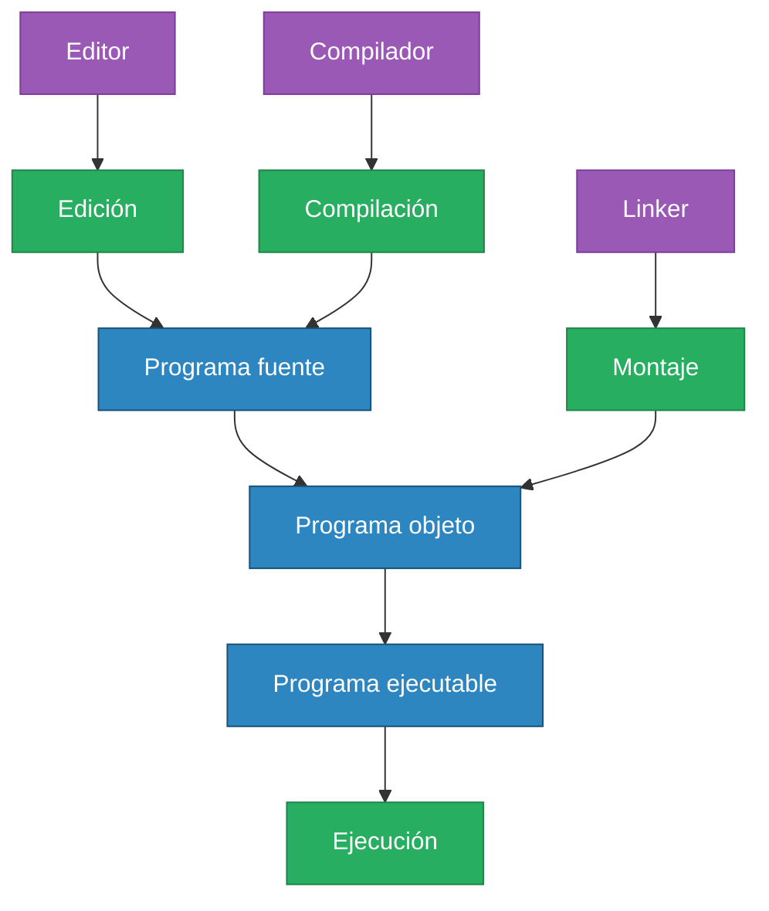

**Lenguajes Interpretados (ej: Python, Javascript, Ruby):**
El proceso es ágil e interactivo. Un intermediario de consola en tiempo real procesa, traduce al vuelo, e impulsa el código a la memoria línea por línea o bloque a bloque sin la necesidad imperiosa de construir previamente un mastodonte de software rígido transpilado en C++. 
Es más lento per se durante iteraciones exigentes si los bucles fuesen puros, pero permite un entorno dinámico y de experimentación ultra rápido, fundamental en *Data Science*.

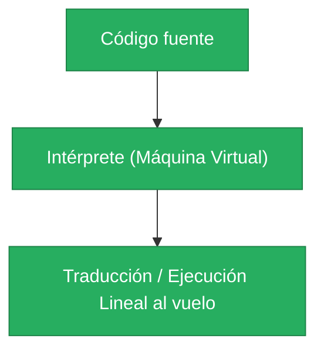

---

## 🚀 ¿Por qué Python?

Python es uno de los lenguajes más usados en Ciencia de datos. ¿Por qué?
* Porque tiene una sintaxis simple y es fácil de adaptar para quienes no vienen de ambientes de ingeniería o ciencia de la informática.

Python es famoso por ser lento comparado con lenguajes como C++, ¿por qué se usa en Machine Learning o IA?
* La respuesta es que no se usa librerías hechas Python. Ninguna de las bibliotecas que se utilizan está realmente escrita en Python.
* Casi siempre están escritos en Fortran o C++ y simplemente interactúan con Python a través de algún wrapper.
* La velocidad de Python es irrelevante si solo se interactúa con las librerías escritas en un C++ altamente optimizado.

Fuente: https://qr.ae/pKrGdr

---

## 💻 Entornos de Ejecución

### Modo interactivo

Python posee un modo interactivo: Se escriben las instrucciones en una especie de intérprete de comandos. Las expresiones pueden ser introducidas una a una.

<div align="center">
  
</div>

### iPython

iPython (Parte de SciPy): Extiende la capacidad del modo interactivo y provee un kernel para Jupyter

<div align="center">
  
</div>

### Jupyter Notebook

Es un entorno computacional interactivo basado en la web para crear documentos de notebook. Jupyter Notebook es similar a la interfaz de notebook de otros programas como Maple, Mathematica y SageMath, un estilo de interfaz computacional que se originó con Mathematica en la década de 1980.

<div align="center">
  
</div>

<div align="center">
  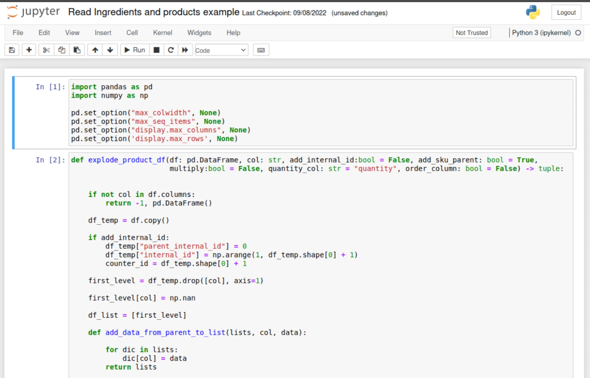
</div>

### Google Colab

Si por algún motivo no podés correr Python de local o tienes un setup malo, podes usar Google Colab en la nube.

Google Colab permite escribir y ejecutar Python en el navegador:
* Sin configurar
* Fácil de compartir
* Acceso a GPUs sin cargo

Es una Jupyter Notebook que corre en una máquina virtual de Google Cloud:
* Es gratuito
* Ofrece 12 GB de RAM y 100 GB de disco.
* Las notebooks quedan en Google Drive, fácil de compartir.

<div align="center">
  
</div>

<div align="center">
  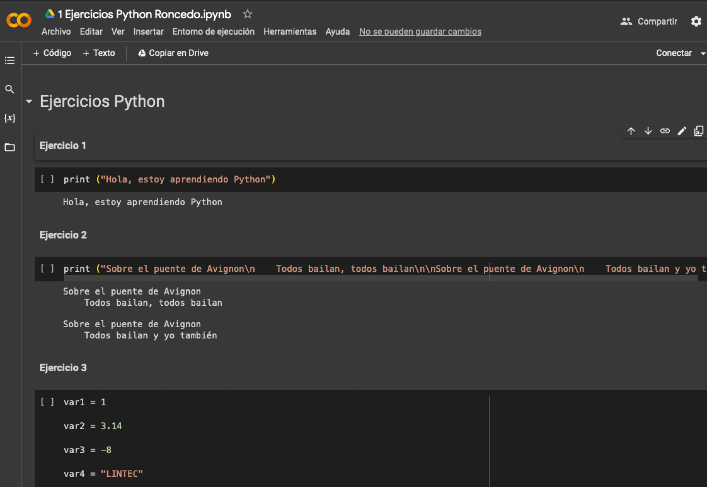
</div>

---

## 📦 Variables en Python

Una **variable** en Python es un nombre simbólico asociado a un objeto en memoria. A diferencia de otros lenguajes con tipado estático (como C o Java), en Python no se declara explícitamente el tipo de la variable al crearla, sino que el intérprete lo infiere dinámicamente en tiempo de ejecución (**Tipado Dinámico**).

* **Nombres de variables:** Son específicos y sensibles a mayúsculas y minúsculas (*case-sensitive*).
* **Asignación:** Se utiliza el signo igual (`=`) para asignar un valor a un nombre o identificador.
* Llamamos al valor objeto a través del nombre de la variable elegida.

**Tipos de variables y colecciones de datos fundamentales:**
* **Numéricas:** Enteros (`int`), flotantes decimales (`float`), números complejos (`complex`).
* **Caracteres:** Cadenas de texto (`str`).
* **Lógicas:** Secuencias lógicas verdaderas o falsas (`bool`).
* **Colecciones y Estructuras:** Listas (`list`), Tuplas (`tuple`), Conjuntos (`set`), Diccionarios (`dict`).

### Funciones útiles para variables

* En Python, con `type()` puedo saber que variable es.
* Además, puedo convertir algunas variables en otra: `int()`, `float()`, `str()`, `bool()`, `list()`, `dict()`
* Preguntar el tipo de variable: `isinstance(a, int)`

### ¿Qué pasa cuando asignamos una variable?

Una variable de Python es un nombre simbólico que es una referencia o puntero a un objeto.

**Paso 1:** 

```python
var_1 = 300
```

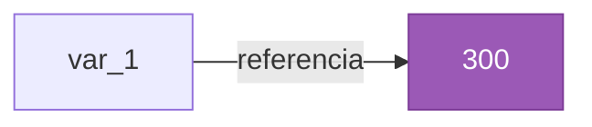

**Paso 2:** 

```python
var_2 = var_1
```

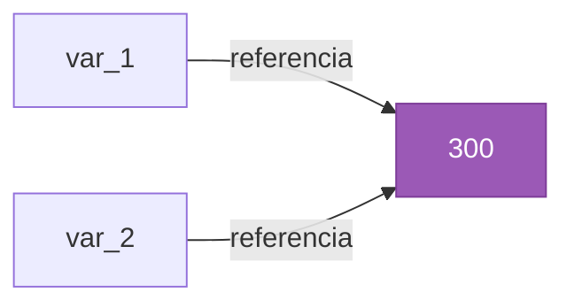

**Paso 3:** 

```python
var_2 = 400
```

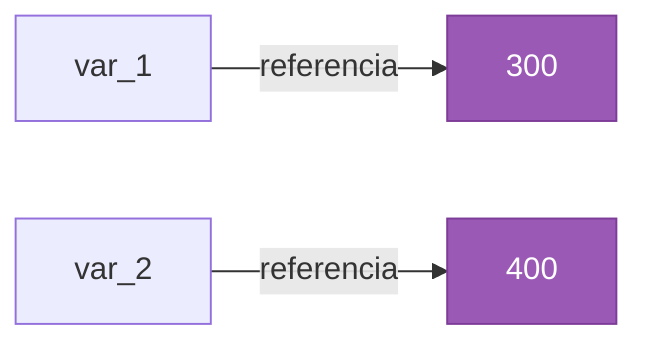

**Paso 4:** 

```python
var_1 = "wut"
```

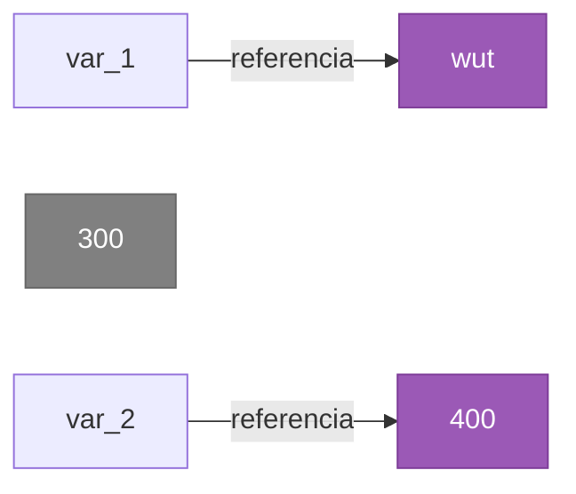

> *300 quedará en memoria RAM (en gris) hasta que el Garbage Collector lo recolecte o asignamos una nueva variable con 300.*

### Mutabilidad

* **Mutables:** Permiten ser modificadas una vez creados.
* **Inmutables:** No permiten ser modificables una vez creados.

| Mutables | Inmutables |
|---|---|
| Listas | Variables numéricas |
| Diccionarios | Strings |
| Sets | Tuplas |

---

## 🧮 Operadores

Los operadores son símbolos especiales que realizan operaciones sobre variables y valores.

### Aritméticos
Permiten realizar operaciones matemáticas regulares entre variables numéricas.

| Operación | Operador | Ejemplo |
|---|---|---|
| Suma | `+` | `x + y` |
| Resta | `-` | `x - y` |
| Multiplicación | `*` | `x * y` |
| División | `/` | `x / y` |
| Módulo | `%` | `x % y` |
| División entera | `//` | `x // y` |
| Exponente | `**` | `x ** y` |

### Comparadores (retornan booleanos)
Evalúan una condición de relación entre dos valores y devuelven un valor de verdad (Booleano: `True` o `False`).

| Operación | Operador | Ejemplo |
|---|---|---|
| Mayor | `>` | `x > y` |
| Menor | `<` | `x < y` |
| Igual | `==` | `x == y` |
| Distinto | `!=` | `x != y` |
| Mayor o igual | `>=` | `x >= y` |
| Menor o igual | `<=` | `x <= y` |

### Lógicos (solo para booleanos)
Permiten combinar lógicamente múltiples sentencias condicionales booleanas.

| Operador | Ejemplo | Descripción |
|---|---|---|
| `and` | `x and y` | Devuelve `True` **solo** si *ambas* sentencias son verdaderas |
| `or` | `x or y` | Devuelve `True` si **alguna** de las sentencias es verdadera |
| `not` | `not x` | Invierte el resultado lógico (`True` -> `False`) |

### De asignación
Se utilizan para guardar un valor, o computar y simultáneamente actualizar un valor dentro de una variable.

| Operación | Operador | Ejemplo |
|---|---|---|
| Asignar | `=` | `x = y` |
| Sumar y asignar | `+=` | `x += y (x = x + y)` |
| Restar y asignar | `-=` | `x -= y (x = x - y)` |
| Multiplicar y asignar| `*=` | `x *= y (x = x * y)` |
| Dividir y asignar | `/=` | `x /= y (x = x / y)` |

### Identificadores (devuelven booleanos)
Sirven para comprobar el estado de los objetos en memoria, evaluando si dos variables comparten el **mismo espacio de memoria** (el mismo objeto referenciado), y no tan solo si sus valores representativos equivalen.

| Operador | Ejemplo |
|---|---|
| `is` | `x is y` |
| `is not` | `x is not y` |

---

## 📚 Funciones y Librerías

### Llamada a funciones

* Las funciones son llamadas con un nombre y entre paréntesis los argumentos:
  `pow(2,5)  # Devuelve 32, es equivalente a 2**5`
* Esta forma de introducir los argumentos se llama de forma posicional.
* Otra forma de introducir los argumentos es mediante keys:
  `pow(exp=5, base=2)`
* Algunas funciones tienen argumentos opcionales:
  `pow(2, 5, mod=3)  # Es equivalente a (2**5) % 3`
* Los argumentos opcionales siempre son en modo de key.

### Funciones Built-In importantes

Built-in Functions de Python: https://docs.python.org/3/library/functions.htmls

* `print()` - Imprime en pantalla una cadena de strings
* `type()` - Retorna el tipo del objeto/variable.
* `abs()` - Retorna el valor absoluto
* `sorted()` - Retorna una lista ordenada del iterable
* `max()` - Retorna el máximo elemento de un iterable
* `min()` - Retorna el mínimo elemento de un iterable
* `round()` - Retorna un flotante redondeado
* `len()` - Retorna la cantidad de elementos en un objeto/iterable
* `sum()` - Suma todos los elementos de un iterable.
* `help()` - Muestra la documentación del objeto

### Importando librerías externas

La declaración `import` permite hacer visibles identificadores de otros módulos.
* Built-in libraries: https://docs.python.org/3/library/


```python
# Forma 1
import math

var = math.sqrt(16)
print(math.pi)
```

```python
# Forma 2
import math as mt

var = mt.sqrt(16)
print(mt.pi)
```

```python
# Forma 3
from math import pi, sqrt 

var = sqrt(16)
print(pi)
```

```python
# Forma 4
from math import *

var = sqrt(16)
print(pi)
```

---

## 🚦 Declaración de Control

Las estructuras de control modifican el flujo de ejecución secuencial del programa mediante directivas lógicas o condicionales.

### IF

La declaración `if` ejecuta un bloque de código **exclusivamente** si la condición interpuesta evalúa lógicamente un valor verdadero (`True`). 

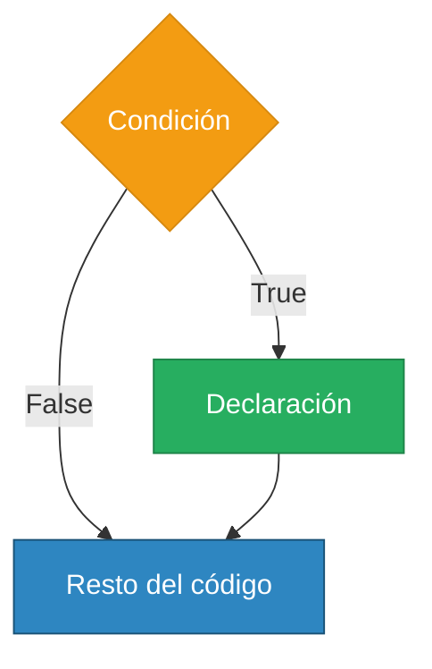

```python
if <Expresión_booleana>:
    <Declaración>

<Resto_del_codigo>
```

```python
if num > 3:
    print("Epaaaa")
```

### IF – Múltiples condiciones en un IF

```python
if 3 < num < 35:
    print("Epaaaa")
```

```python
if 3 < num < 35 or b == 2:
    print("Epaaaa")
```

```python
if num > 3 and (num < 5 or b == 2):
    print("Epaaaa")
```

### IF-ELSE

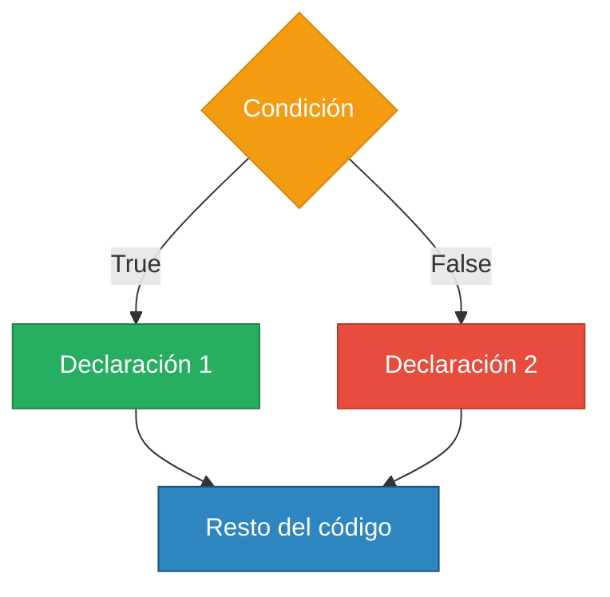

```python
if <Expresión_booleana>:
    <Declaración_1>
else: 
    <Declaración_2>

<Resto_del_codigo>
```

```python
if num > 3:
    print("num es mayor a 3")
else:
    print("num es menor o igual a 3")
```

### Nested IF-ELSE

```python
if <Expresión_1>:
    <Declaración_1>
    if <Expresión_2>:
        <Declaración_2>
else: 
    <Declaración_3>
    if <Expresión_4>:
        <Declaración_4>

<Resto_del_codigo>
```

```python
if num > 3:
    print("num es mayor a 3")
    if num < 5: 
        print("num es menor a 5")
else:
    print("num es menor o igual a 3")
    if num > 1:
        print("num es mayor a 1")
```

### ELIF

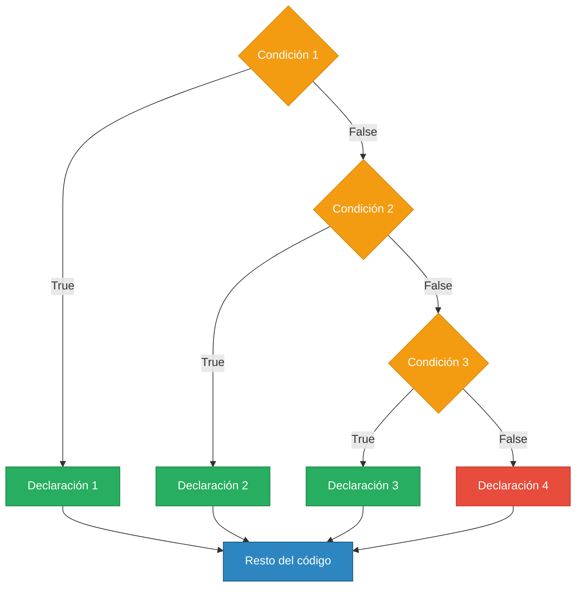

```python
if <Expresión_1>:
    <Declaración_1>
elif <Expresión_2>:
    <Declaración_2>
elif <Expresión_3>:
    <Declaración_3>
else: 
    <Declaración_4>

<Resto_del_codigo>
```

```python
if num == 3:
    print("num es 3")
elif num == 5:
    print("num es 5")
elif num == 42:
    print("num es 42")
else:
    print("num no es 3, 4, o 42")
```

---

## 🔄 Bucles

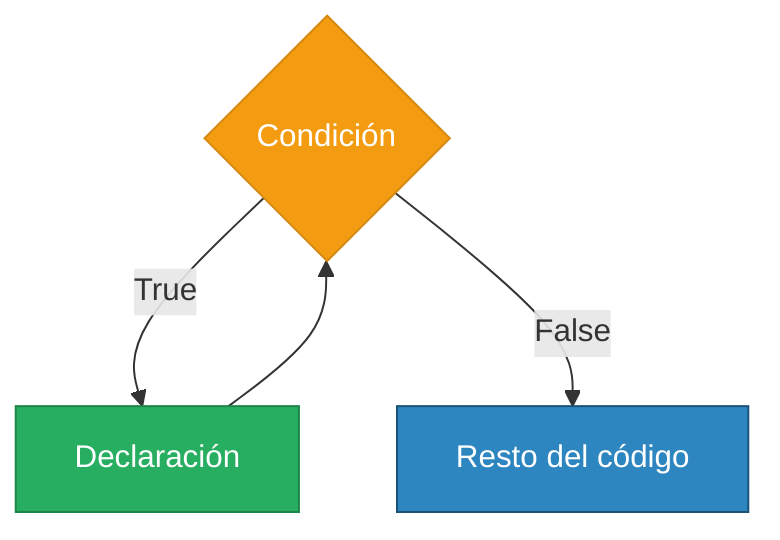

### While

No es el bucle más popular de Python

```python
while <Expresión>:
    <declaración_1>
    <declaración_2>
    ...
    <declaración_n>

<Resto_del_codigo>
```

```python
nivel = 0
while nivel <= 9000:
    print("Aumentando de nivel")
    nivel += 1

print("It's over 9000!!")
```

### Ciclo FOR

```python
for <iterable> in <objeto_iterable>:
    <declaración_1>
    <declaración_2>
    ...
    <declaración_n>

<Resto_del_codigo>
```

```python
producto = 0
for value in range(1, 11):
    producto *= value
```

### Iterables

Un **iterable** en Python es cualquier objeto capaz de retornar un miembro a la vez en secuencia, permitiendo así que sea transitado (iterado) mediante un bucle como `for`.

* Colecciones como listas, tuplas, strings, diccionarios y conjuntos (sets) son internamente iterables.
* Los **generadores** son un equivalente a los iterables convencionales, pero con una ejecución optimizada (lazy execution), que evita guardar cada elemento calculando su contenido solamente en el instante en que se lo necesita en el flujo de memoria.

* Python dispone de la excelente función integradora `range(start, stop, step)` la cual genera una cadena de números enteros útil para transitar a través de una lista u operar bucles por índicación numérica.

```python
for i in range(10):
    print(i)
```

Ejemplos de iteración sobre: Lista o tupla, String, Diccionario

```python
lista = [0, 'alice', 3.14]
for elemento in lista:
    print(elemento)
```

```python
string = "Buenas noches América!"
for char in string:
    print(char)
```

```python
diccionario = {
    "nombre": "Aureliano",
    "apellido": "Buendia",
    "pais": "Colombia"
}
for key in diccionario:
    print(key)
    print(diccionario[key])
```

---

## 🔡 Strings y sus operaciones

* Strings pueden ser comparados. Se comparan carácter a carácter. El orden es en ASCII (https://elcodigoascii.com.ar)
* Es decir `'a'` es menor a `'b'`, pero `'A'` es menor a `'a'`.
* También podemos usar el `+` para concatenar dos caracteres:
  `"Aureliano" + "Buendia"  # Retorna "AurelianoBuendia"`
* Si usamos `*` con un entero, repite el string:
  `"Aureliano" * 2  # Retorna "AurelianoAureliano"`

### Índices y cortes

Podemos cortar un string usando índices. Los cortes se puede determinar en rangos.

```python
nombre_completo = "Aureliano Buendia"

nombre_completo[0] # Retorna A
```

```python
nombre_completo[inicio:superior]

nombre_completo[0:9]   # Retorna Aureliano
nombre_completo[:9]    # Retorna Aureliano
nombre_completo[10:17] # Retorna Buendia
nombre_completo[:17]   # Retorna Buendia
nombre_completo[-7:]   # Retorna Buendia
```

### Métodos de Strings

* Recordar que todo en Python es un objeto. Los objetos tienen atributos y métodos.
* Métodos son similares a funciones, toman argumentos, realizan una acción y devuelven algo:
  `<object>.<nombre del método>(<lista de argumentos>)`
* Strings son objetos, por lo que tienen métodos

```python
nombre_completo = "Aureliano Buendia"

nombre_completo.isupper()               # Retorna False
nombre_completo.upper()                 # Retorna AURELIANO BUENDIA
nombre_completo.lower()                 # Retorna aureliano buendia
nombre_completo.startswith("Aureliano") # Retorna True
```

---

## 📋 Listas

* Una lista es una secuencia de cero o más objetos en Python normalmente llamados ítems.
* Las listas son mutables.
* Se generan usando `[]` y los ítems se separan en coma.

```python
[] # Lista vacia
["Aureliano"] # Lista con un solo string
["Aureliano", "Buendia"] # Lista con dos strings
["Aureliano", "Buendia", 42] # Lista con dos strings y un entero
["Aureliano", ["Buendia", 42]] # Lista con un string y una lista
["Aureliano",  "Buendia", print] # Lista con dos strings y una función
```

### Acceso por índices

Las listas también se pueden acceder a ítems mediante índices y cortarlas en sublistas.

```python
list_range = list(range(0, 22, 2))

list_range[2]     # Retorna 4
list_range[:9]    # Retorna [0, 2, 4, 6, 8, 10, 12, 14, 16]
list_range[5:9]   # Retorna [10, 12, 14, 16]
list_range[-1]    # Retorna 20
list_range[-7:-1] # Retorna [8, 10, 12, 14, 16, 18]
```

### Métodos de listas

```python
listita = []           # listita es una lista vacia
listita.append(42)     # listita es [42]
listita.append(19)     # listita es [42, 19]
listita.sort()         # listita es [19, 42]
var = listita.pop()    # Guarda en var a 42, lisita es [19]
listita.append(0, 22)  # listita es [22, 19]
listita.append(-1, 55) # listita es [22, 55, 19]
listita.remove(22)     # listita es [55, 19]
listita.remove(22)     # Error (ValueError)
```

---

## 📌 Tuplas

* Una tupla es una secuencia de cero o más objetos Python normalmente llamados ítems.
* Las tuplas son inmutables.
* Se generan usando `()` y los ítems se separan en coma.

```python
("Aureliano",) # Tupla con un solo string
("Aureliano", "Buendia") # Tupla con dos strings
("Aureliano", "Buendia", 42) # Tupla con dos strings y un entero
("Aureliano", ["Buendia", 42]) # Tupla con un string y una lista
("Aureliano", "Buendia", print) # Tupla con dos strings y una función
```

---

## 🔁 Volvamos al ciclo FOR

* FOR es realmente útil para iterar en ítems en secuencias como strings, listas y tuplas, entre otros…
* Es equivalente:

```python
listita = [4, 8, 15, 16, 23, 42]
for item in listita:
    print(item)
```

```python
listita = [4, 8, 15, 16, 23, 42]
for index in range(len(listita)):
    print(listita[index])
```

### ¿Y si quiero también el index?

```python
listita = [4, 8, 15, 16, 23, 42]
for index, item in enumerate(listita):
    print(f"Posicion {index}")
    print(f"Elemento {item}")
```

---

## 📖 Diccionario

* Un diccionario es una secuencia de un key único con un valor.
* Los diccionarios son mutables.
* Se generan usando `{}` y los ítems se separan en coma.

```python
dictionary1 = {} # Un diccionario vacio
dictionary = {
  "nombre": "Aureliano",
  "apellido": "Buendia",
  "edad": 42,
  "hobbies": ["tenis", "cocer"]
} # Un diccionario con 4 entradas
```

### Acceso y métodos

* Accedemos usando las keys

```python
name = dictionary["nombre"] # Guarda en name el valor "Aureliano"
```

```python
name = dictionary.pop("nombre") # Guarda el valor "Aureliano" y lo saca del diccionario.
dictionary["ciudad"] = "Macondo" # Agrega la nueva key ciudad.
dictionary.update(dictionary2) # Agrega las keys y valores de otro diccionario
```

### Ciclo FOR con el diccionario

```python
for key in dictionary:
    print(key) # Imprime solo las keys
```

```python
for key, value in dictionary.items():
    print(key)
    print(value) # Imprimimos tambien los valores de cada key
```
---

## 🎨 String Formatting

Si queremos formar texto junto a variables, hay al menos 4 formas de hacerlo 😕

Queremos imprimir usando las variables:
"Hola, tu nombre es Aureliano Buendia y tu edad es 42. Un tercio es 0.333"

```python
nombre = "Aureliano"
apellido = "Buendia"
edad = 42
tercio = 1/3
```

### Modo 1: Usando el operador `%`

```python
texto_1 = "Hola, tu nombre es %s %s y tu edad es %d. Un tercio es %.3f" % (nombre, apellido, edad, tercio)
print(texto_1)
```

### Modo 2: Usando el método `.format()`

```python
texto_2 = "Hola, tu nombre es {} {} y tu edad es {}. Un tercio es {:.3f}".format(nombre, apellido, edad, tercio)
print(texto_2)
```

```python
texto_3 = "Hola, tu nombre es {nom} {ape} y tu edad es {ed}. Un tercio es {ter:.3f}".format(
    nom=nombre, ape=apellido, ed=edad, ter=tercio
)
print(texto_3)
```

### Modo 3: Usando f-strings

```python
texto_4 = f"Hola, tu nombre es {nombre} {apellido} y tu edad es {edad}. Un tercio es {tercio:.3f}"
print(texto_4)
```

### Modo 4: Transformando y concatenando

```python
texto_5 = "Hola, tu nombre es " + nombre + " " + apellido + " y tu edad es " + str(edad) + ". Un tercio es " + str(round(tercio, 3))
print(texto_4)
```

---

## 🛠️ Funciones

Las funciones son bloques de código encapsulado y reutilizable diseñados para realizar una tarea particular pre-diseñada por el arquitecto del código.
Ayudan fundamentalmente a mantener el código modular, ordenado y escalable, eliminando la repetición destructiva del código (basados en la filosofía de diseño DRY, *Don't Repeat Yourself*).

### Creación de nuevas funciones y abstracciones

Por ejemplo, supongamos que queremos calcular matemáticamente un número combinatorio:

$$ C(m, n) = \frac{m!}{(m-n)!n!} $$

Donde $n!$ (el factorial de $n$) es el producto concatenado de los números enteros de 1 a $n$.

$$ n! = 1 \cdot 2 \cdot 3 \dots (n-1) \cdot n = \prod_{i=1}^{n} i $$

Si lo hiciéramos procedimentalmente (es decir, en líneas de código continuas sin encapsular), se vería así:

```python
# Factorial de n!
f = 1
for i in range(1, n + 1):
    f *= i
```

```python
n, m = 3, 5

# Numerador
num = 1
for i in range(1, m + 1):
    num *= i

# Denominador
den_a = 1
for i in range(1, n + 1):
    den_a *= i

den_b = 1
for i in range(1, m - n + 1):
    den_b *= i

den = den_a * den_b

# Resultado
num_conv = num / den
```

### Modularización con funciones

Escribir el mismo código una y otra vez es propenso a errores y difícil de mantener el código. Si creamos una función que haga la multiplicación va a ser mucho más sencillo.

```python
def <nombre_función>(argumentos):
    <secuencia_de_código>
```

```python
def factorial(n):
    """Calcula el factorial de n"""
    output = 1
    for i in range(1, n + 1):
        output *= i

    return output

def num_con(n, m):
    """Calcula el numero combinatorio de n y m
  
    n es la cantidad de objetos a seleccionar de un conjunto total de m objetos
    """

    return int(factorial(m) / (factorial(n) * factorial(m - n)))
```

### Variables locales y ámbito (*Scope*)

Las variables definidas internamente dentro del cuerpo de una función existen y perduran **solamente** a lo largo de la ejecución interior para dicha función (esto asienta formalmente una **variable local**). 

Su ámbito (scope) es limitadísimo; nacen cuando la función es llamada, y se depuran del sistema elásticamente en cuanto a la función devuelve su evaluación final. Las funciones lógicamente deben estar previamente declaradas en el script antes de que en el código pretendamos llamarlas y usarlas.

```python
first() # Da error porque la función todavía no fue declarada en las variables lógicas (No definida)

def first():
    print("Hola")
    second() # Acá no salta error, la función second() será buscada recién cuando corramos en el futuro esta función 'first()'

def second():
    print("Hola, soy segunda")

first() # Aquí es correcto (ambas funciones ya existen interpretadas en el entorno)
```

### Argumentos condicionales y con valores opcionales predeterminados

Podemos agregar valores `default` en la firma de nuestra función. En caso de que un iterador o un usuario accione la función presencial sin declarar los argumentos a detalle, esta tomará su forma neutra.

```python
def factorial(n, print_output=False):
    """Calcula el factorial de n"""
    output = 1
    for i in range(1, n + 1):
        output *= i

    if print_output:
        print(output)

    return output
```

### Retorno múltiple

Se pueden retornar muchos valores (que se obtendrán como en una tupla).

```python
def conv_segundos(segundos):
    horas = segundos // (60 * 60)
    rest_horas = segundos % (60 * 60)
    minutos = rest_horas // 60
    segundos = rest_horas % 60

    return horas, minutos, segundos
```

### Funciones recursivas

La **recursión** es una técnica computacional donde una función se llama abstractamente a sí misma para resolver reducciones pequeñas de sub-problemas derivados de un problema central mayor. Toda función recursiva debe incorporar indefectiblemente un punto preprogramado de quiebre algorítmico o "condición de corte base" para jamás sumergirse en un re-llamado cíclico e infinito de la memoria RAM.

```python
def recu_fibo(n):
    if n <= 1:
        return n
    else:
        return recu_fibo(n - 1) + recu_fibo(n - 2)
```

### Funciones Lambda

Las funciones **Lambda** son pequeñas funciones "anónimas" (es decir, prescinden de la convención de la palabra estipulada `def` y de tener un nombre con vida propia temporal) definidas usualmente en una pura y sola directiva en el renglón basándose en la palabra clave `lambda`.

Son increíblemente útiles en situaciones que requieran una simple ejecución efímera y de resolución algorítmica sin tanto protocolo, como por ejemplo al pasarlas como parámetros incrustadas directamente dentro un `map()`, un `.sort(key=lambda)` o un `filter()`.

```python
sum_one = lambda x : x + 1
print(sum_one(2)) # Imprime 3
print((lambda x : x + 1)(2)) # Imprime 3

sum_two_numbers = lambda x, y : x + y
print(sum_two_numbers(2, 4)) # Imprime 6

# Lambda condicional (si x es impar retorna x, si es par retorna -1)
conditional = lambda x : x if x % 2 else -1
print(conditional(3)) # Imprime 3 (porque 3 % 2 es 1, evaluado como True)
print(conditional(4)) # Imprime -1 (porque 4 % 2 es 0, evaluado como False)
```

---

## ⚡ List Comprehension y Generators

### List Comprehension

* Es una expresión que genera una colección basada en otra colección.
* En general produce listas.
* Sintaxis simple y limpia.
* Soporta condicionales.
* Puede ser lazy.
* Es una de las herramientas más importante en Python

```python
[<state> for <var> in <iterable> if <predicate>]
```

```python
even_squared = [x**2 for x in range(20) if not x % 2]
```

* Computa todos los valores cuando se crea (ocupa memoria).
* Es preferible usar List comprehension antes que bucles.
* También existen los:
  * Set comprehension
  * Dictionary comprehension

### Generators

Generan valores de forma lazy (no ocupan memoria) pero se consumen.

```python
[x for x in range(10**20)] # Consumiría prácticamente toda la memoria RAM
```

```python
generator = (x for x in range(10**20)) 
print(next(generator)) # Imprime 0
print(next(generator)) # Imprime 1
# ...
print(next(generator)) # Imprime 10**20 - 1
print(next(generator)) # Da error StopIteration
```

---

## 🏛️ Clases y Objetos

Python tiene capacidad plena para modelar objetos complejos inspirados en la vida real a través de la **Programación Orientada a Objetos** (POO o OOP por sus siglas en inglés).

* **Clase (`class`):** Es una plantilla maestra o "molde" que describe la arquitectura para crear entidades. Define **atributos** (variables inherentes al objeto) y **métodos** (funciones y acciones que el objeto puede realizar).
* **Objeto (o Instancia):** Es la entidad concreta y utilizable creada a partir del esqueleto de una Clase. Cada objeto tiene sus propios datos iterables.
* **El método `__init__`:** Es el constructor de la clase. Se ejecuta automáticamente cuando instanciamos un nuevo objeto, y se usa para inicializar los atributos de esa instancia particular.
* **El parámetro `self`:** Hace referencia al objeto mismo. Todo método de instancia debe recibir `self` como su primer parámetro obligatorio, ya que así Python sabe a qué objeto específico le está alterando los datos.

### Ejemplo conceptual de una Clase

```python
class new_class:
    '''Documentación de la clase'''
    
    def __init__(self, atr1, atr2):
        self.atr1 = atr1
        self.atr2 = atr2
        
    def method_1(self, x):
        '''Documentación del método'''
        return x
        
    def method_2(self, y):
        return y
```

### Instanciación de Objetos

Para crear un objeto (instanciarlo), simplemente "llamamos" al nombre de la clase pasándole los argumentos que necesita su método `__init__` (omitiendo `self`, que Python pasa automáticamente):

```python
obj1 = new_class(1, 2)
obj2 = new_class(4, 4)
obj3 = new_class(23, 4)
```

### Ejemplo Práctico: Modelando un Auto

Para entenderlo mejor, modelemos algo físico como un auto:

```python
class car:
    '''Es una clase para autos'''
    
    rueda = 4 # Atributo de clase (compartido por todas las instancias)
    
    def __init__(self, color, brand):
        # Atributos de instancia (propios de cada objeto)
        self.color = color
        self.brand = brand
        self.velocidad = 0
        
    def bocina(self):
        '''Toca la bocina'''
        print("Piiiiiii")
        
    def acelerar(self, x):
        self.velocidad += x
        
    def frenar(self):
        self.velocidad = 0
```

Ahora creamos dos autos distintos y operamos con ellos. Notá que la velocidad (estado interno) muta de forma local en cada vehículo independientemente del otro.

```python
auto_1 = car("rojo", "Ford")
auto_2 = car("verde", "Chevrolet")

print(auto_1.ruedas) # Imprime 4 (Atributo de clase)
print(auto_1.brand)  # Imprime Ford

auto_1.bocina() # Imprime Piiiiiii

auto_2.acelerar(120)
print(auto_2.velocidad) # Imprime 120
print(auto_1.velocidad) # Imprime 0

auto_2.frenar()
print(auto_2.velocidad) # Imprime 0
```

### Herencia

La **herencia** nos permite componer superestructuras y "heredar" (o reescribir) métodos y atributos padres fácilmente. Esto crea una familia ramificada de módulos u objetos sin tener que reescribir código idéntico repetidamente.

Al heredar, la *subclase* adquiere todo el comportamiento de la *clase padre*, pero puede agregar atributos nuevos o métodos especializados.

```python
class carFord(car):
    def __init__(self, color, model):
        # super().__init__ llama al constructor de la clase padre (car)
        super().__init__(color, "Ford")
        self.modelo = model
        
    def cambiar_color(self, new_color):
        self.color = new_color
```

```python
mi_ford = carFord("azul", "Mustang")

print(mi_ford.brand)  # "Ford" (Heredado de car)
print(mi_ford.modelo) # "Mustang" (Propio de carFord)
mi_ford.bocina()      # Piiiiiii (Método heredado de car)

mi_ford.cambiar_color("negro") # Método propio de carFord
print(mi_ford.color)  # "negro"
```