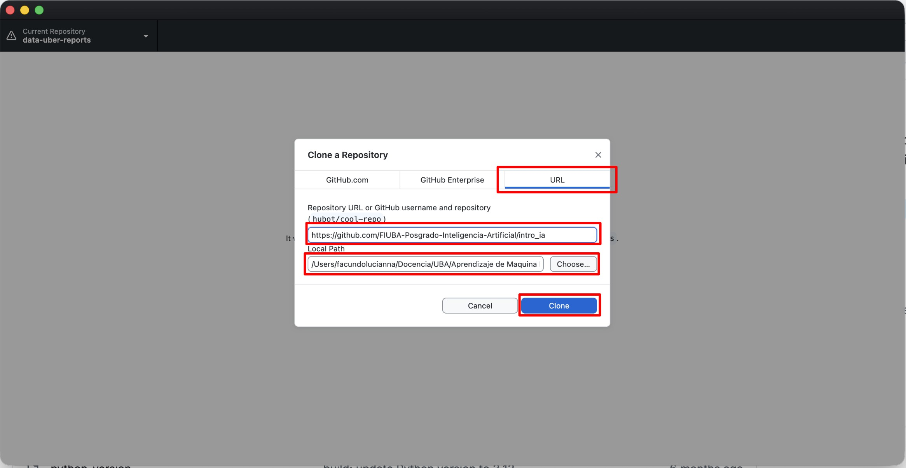
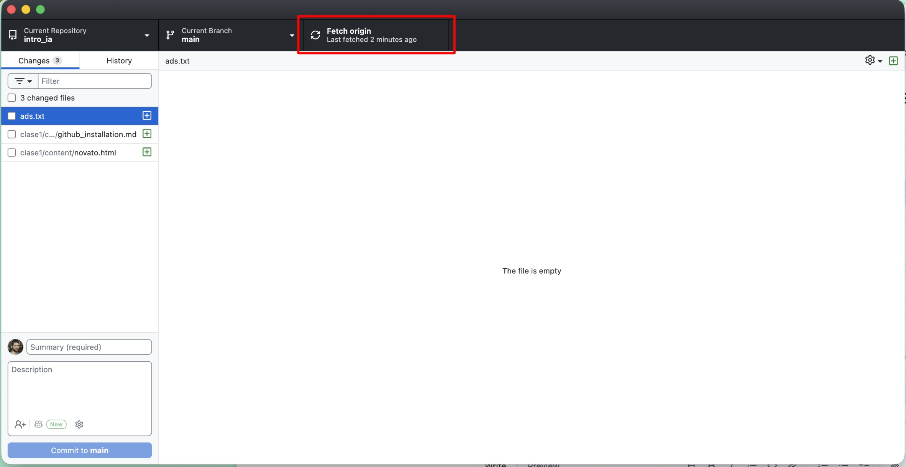
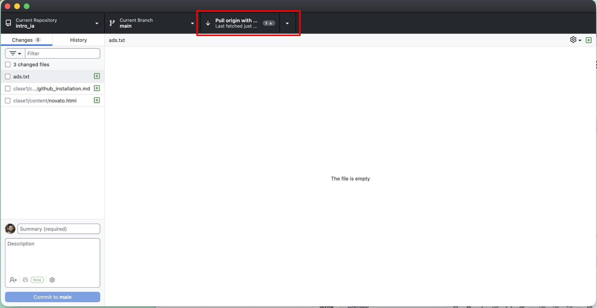
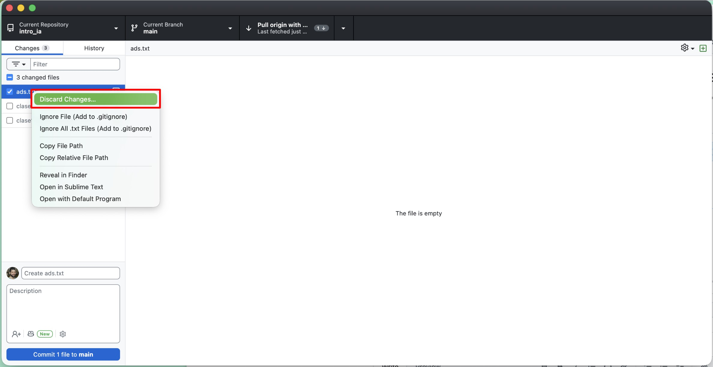
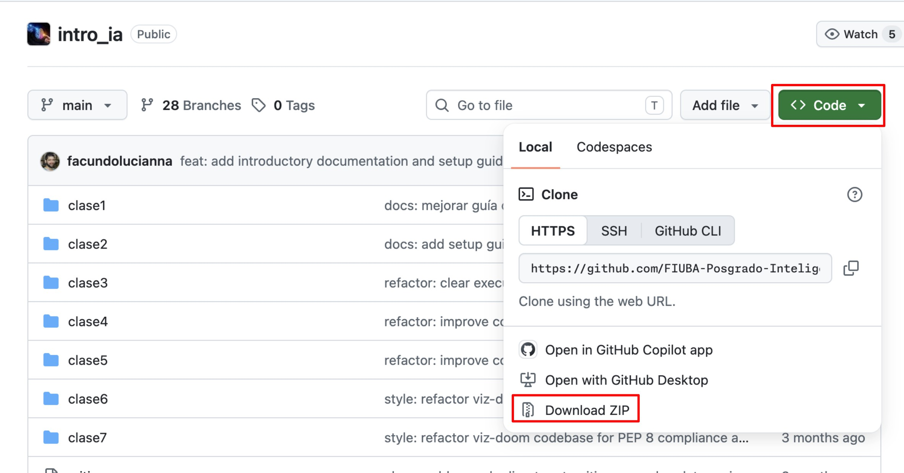
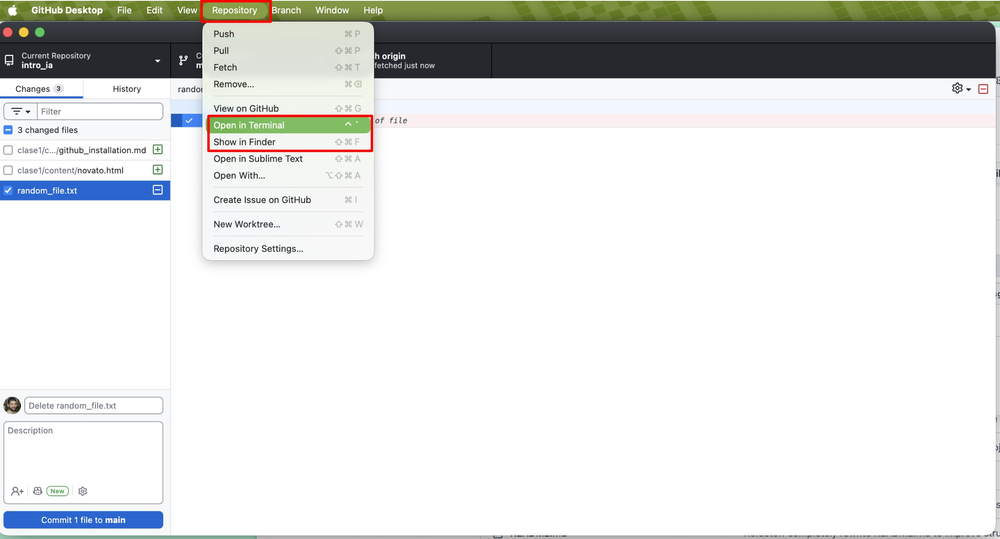

# Guía de instalación de Git y GitHub Desktop 🐙

Todo el material de la materia (notebooks, ejercicios, presentaciones) vive en un **repositorio** de GitHub. Esta guía te explica cómo bajarlo a tu computadora y, sobre todo, cómo mantenerlo actualizado a lo largo de la cursada **sin usar la terminal**.

> [!NOTE]
> Esta guía es el **paso previo** a preparar tu entorno de Python. Cuando termines acá, seguí con la 👉 [Guía de herramientas de desarrollo - Modo Novato 🙂](./modo_novato.md), que te va a pedir justamente la carpeta que vas a crear en estos pasos.

---

### 🤔 ¿Qué es Git y qué es GitHub?

Son dos cosas distintas y se confunden todo el tiempo:

* **Git** es un programa que lleva el historial de un proyecto: quién cambió qué, cuándo, y permite volver atrás. Es la herramienta.
* **GitHub** es un sitio web donde se alojan proyectos que usan Git, para compartirlos. Es el lugar.
* **GitHub Desktop** es una aplicación con botones que maneja Git por vos, para no tener que escribir comandos. Es lo que vamos a usar.

Para cursar no necesitás aprender Git: te alcanza con dos botones de GitHub Desktop, **Clone** (bajar el material la primera vez) y **Pull** (traer lo nuevo cada semana). El resto es opcional.

---

> [!NOTE]
> ### 💻 Paso 1: Instalar GitHub Desktop
>
> 1. Entrá a [desktop.github.com](https://desktop.github.com/) y descargá la versión para tu sistema operativo.
> 2. **Windows:** ejecutá el instalador `.exe`; se instala solo y se abre al terminar.
> 3. **macOS:** descomprimí el `.zip` y arrastrá **GitHub Desktop** a la carpeta *Aplicaciones*. Fijate de elegir la descarga correcta según tu procesador (Apple Silicon o Intel).
> 4. Al abrirlo por primera vez te va a ofrecer iniciar sesión con una cuenta de GitHub. **No es obligatorio** para bajar el material de la materia: podés elegir *Skip this step* y completar tu nombre y correo. De todos modos, crearte una cuenta gratuita es recomendable si más adelante querés subir tus propios proyectos.

> [!TIP]
> **¿Ya tenés Git instalado?** No importa: GitHub Desktop trae su propia copia de Git adentro y no interfiere con la que ya tengas.

---

### 📥 Paso 2: Clonar el repositorio de la materia

"Clonar" es simplemente **bajar una copia** del repositorio a tu computadora, que después vas a poder actualizar con un botón.

1. En GitHub Desktop, andá al menú **File → Clone repository...**
2. Elegí la solapa **URL**.
3. En el primer campo pegá la dirección del repositorio:

   ```
   https://github.com/FIUBA-Posgrado-Inteligencia-Artificial/intro_ia
   ```

4. En **Local path** elegí en qué carpeta de tu computadora se va a guardar. Anotá o recordá esta ruta: la vas a necesitar más adelante.
5. Hacé clic en **Clone** y esperá a que termine de descargar.



Cuando termine, vas a tener una carpeta llamada `intro_ia` con todo el material adentro. Ya podés abrirla como cualquier carpeta común.

> [!WARNING]
> **Cuidado con dónde la guardás.** Evitá carpetas sincronizadas con **OneDrive**, **Google Drive** o **Dropbox** (en Windows, la carpeta *Documentos* suele estarlo). La sincronización pelea con los archivos que van creando Python y Jupyter, y termina en errores raros y difíciles de diagnosticar.
>
> Una ruta simple y segura es algo como `C:\Users\tu_usuario\intro_ia` en Windows, o `/Users/tu_usuario/intro_ia` en macOS. Evitá también acentos y eñes en la ruta.

> [!TIP]
> ### 📂 ¿Dónde quedó la carpeta?
> Si te olvidaste de la ruta, con el repositorio abierto en GitHub Desktop andá a **Repository → Show in Explorer** (o **Show in Finder** en macOS). Te abre la carpeta directamente.
>
> Ese es el atajo que te conviene usar cuando el Modo Novato te pida "posicionarte en la carpeta donde clonaste el repositorio": abrís la carpeta desde acá y la arrastrás a la terminal.

---

### 🔄 Paso 3: Actualizar el material (esto lo vas a hacer todas las semanas)

El material se va publicando y corrigiendo a lo largo de la cursada. Para traer las novedades **no hace falta volver a descargar nada**:

1. Abrí GitHub Desktop.
2. Hacé clic en **Fetch origin** (arriba a la derecha). Eso revisa si hay novedades.
3. Si las hay, el botón cambia a **Pull origin**. Hacé clic de nuevo y listo: tu carpeta queda actualizada.

Así se ve el botón cuando no hay novedades pendientes:



Y así después de hacer clic, cuando detectó que hay material nuevo para bajar (el número indica cuántos cambios trae):



Tomate el hábito de hacerlo antes de cada clase.

---

> [!WARNING]
> ### ⚠️ El problema más común: "no me deja actualizar"
>
> Si vos editaste un archivo del repositorio (por ejemplo, resolviste un ejercicio dentro de su notebook) y la cátedra también lo modificó, Git no sabe cuál versión conservar y el **Pull** falla o queda en conflicto.
>
> **La forma de no pasar nunca por esto:** no trabajes sobre los archivos originales. Antes de resolver un ejercicio, **hacé una copia de la notebook** y trabajá sobre la copia, ya sea renombrándola (`exercise_2_APELLIDO.ipynb`) o guardándola en una carpeta tuya fuera del repositorio. Así el original nunca se toca y el Pull siempre funciona.
>
> **Si ya te pasó:** en la pestaña **Changes** de GitHub Desktop vas a ver la lista de archivos que modificaste. Copiá esos archivos a otra carpeta para no perder tu trabajo y recién ahí hacé clic derecho sobre ellos → **Discard changes**, que devuelve los archivos a la versión original y te destraba el Pull.
>
> Ojo: **Discard changes borra tus cambios de forma definitiva**. Hacé la copia de seguridad *antes*.



---

<details>
<summary>🆘 Plan B: bajar el material sin instalar nada</summary>

Si no podés instalar GitHub Desktop, podés descargar el material como un archivo comprimido:

1. Entrá al [repositorio de la materia](https://github.com/FIUBA-Posgrado-Inteligencia-Artificial/intro_ia).
2. Hacé clic en el botón verde **Code** y elegí **Download ZIP**.
3. Descomprimí el archivo donde quieras trabajar.



**La desventaja es importante:** cada vez que la cátedra publique material nuevo vas a tener que repetir todo el proceso a mano y reorganizar tus archivos. Por eso lo dejamos como último recurso, no como opción recomendada.

</details>

---

<details>
<summary>⌨️ Para quienes quieran usar Git desde la terminal</summary>

GitHub Desktop trae su propia copia de Git, pero **no la deja disponible en la terminal**. Si escribís `git` en una consola y te dice que no encuentra el comando, es por eso. Para usar Git por línea de comandos hay que instalarlo aparte:

* **Windows:** [Git for Windows](https://git-scm.com/download/win).
* **macOS:** ejecutá `xcode-select --install` en la Terminal, que instala las herramientas de línea de comandos de Apple (Git incluido).
* **Linux:** viene en el gestor de paquetes de tu distribución (por ejemplo `sudo apt install git`).

Con Git instalado, clonar el repositorio es un solo comando:

```bash
git clone https://github.com/FIUBA-Posgrado-Inteligencia-Artificial/intro_ia.git
```

Y para actualizarlo, parado dentro de la carpeta:

```bash
git pull
```

> [!WARNING]
> GitHub Desktop tiene un atajo **Repository → Open in Command Prompt** (o *Terminal*). Sirve para abrir una consola ya posicionada en la carpeta del repositorio, pero **no la uses para los comandos de `conda`**: en Windows abre PowerShell o CMD, donde `conda` no funciona. Para el entorno de Python, abrí siempre el **Anaconda Prompt**, como se explica en el [Modo Novato](./modo_novato.md).



*La captura corresponde a macOS. En Windows las mismas opciones se llaman **Open in Command Prompt** y **Show in Explorer**.*

</details>

---

**📚 Referencias oficiales:**
* [Documentación de GitHub Desktop](https://docs.github.com/es/desktop)
* [Clonar un repositorio desde GitHub Desktop](https://docs.github.com/es/desktop/adding-and-cloning-repositories/cloning-a-repository-from-github-to-github-desktop)
* [Documentación oficial de Git](https://git-scm.com/doc)
