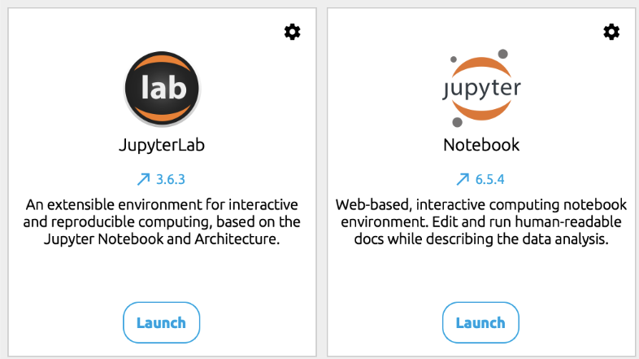
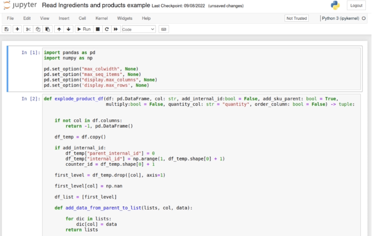
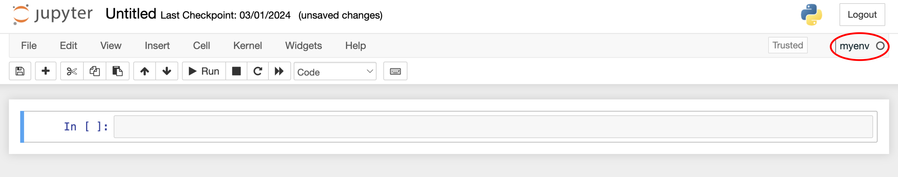

# Guía de instalación de Jupyter Notebook

**[Jupyter Notebook](https://jupyter.org/)** es un entorno computacional interactivo basado en la web para crear documentos tipo "notebook". Es similar a las interfaces de otros programas como Maple, Mathematica y SageMath, un estilo de interfaz computacional que se originó con Mathematica en la década de 1980. El nombre del proyecto Jupyter hace referencia a tres lenguajes de programación principales para los que fue diseñado: Julia, Python y R.


Un documento de Jupyter Notebook es un archivo en formato JSON, que sigue un esquema versionado y contiene una lista ordenada de celdas de entrada/salida. Estas celdas pueden incluir código, texto (en formato [Markdown](https://www.markdownguide.org/)), fórmulas matemáticas, gráficos y texto enriquecido. Estos documentos suelen tener la extensión `.ipynb`.

---

### 🚀 Iniciando Jupyter (usando Anaconda)

Desde Anaconda Navigator se puede acceder a Jupyter Notebook directamente desde la sección **Home**.



> [!TIP]
> **✅ Tip:** Aseguráte de que el entorno que estás usando esté correctamente seleccionado.



---

### 💻 Iniciando Jupyter desde la consola

También se puede iniciar Jupyter desde la línea de comandos ejecutando:

```bash
jupyter notebook
```

> [!TIP]
> **✅ Tip:** Aseguráte de estar en el entorno virtual correcto antes. Si estás usando **conda**, actívalo con:
> 
> ```bash
> conda activate nombre_entorno
> ```

---

### ⚙️ Jupyter Kernels

Un kernel de Jupyter es un programa responsable de manejar varios tipos de solicitudes (como ejecución de código, autocompletado e inspección) y proporcionar respuestas. Los kernels se comunican con los demás componentes de Jupyter a través de la red, por lo que pueden estar en la misma máquina o en máquinas remotas.

> [!NOTE]
> ### 💡 ¿Qué significa esto en la práctica?
> Esto significa que podemos tener un kernel dentro de nuestro entorno de desarrollo y ejecutar la interfaz de Jupyter Notebook de forma completamente desacoplada (incluso en otra máquina o servidor). Una vez dentro del entorno de la interfaz, podremos usar ese kernel para ejecutar código.

Para lograrlo, dentro del entorno virtual debemos tener instalada la librería **ipykernel**. Usando **conda** sería:

```bash
conda install -c conda-forge ipykernel
```

Luego, dentro del mismo entorno virtual desde la terminal, instalamos y registramos el kernel para Jupyter con el siguiente comando:

```bash
python -m ipykernel install --user --name=myenv
```

Después de esto, al ejecutar Jupyter, aparecerá el kernel con el nombre **myenv** entre las opciones disponibles en la interfaz.



---

<details>
<summary>✨ Bonus: Jupyter en Visual Studio Code</summary>

La funcionalidad técnica de los kernels también permite usar y crear notebooks de Jupyter desde IDEs que lo soporten nativamente, como **Visual Studio Code**.

Acá les dejamos la guía oficial sobre cómo configurar VS Code para trabajar fluidamente con notebooks:

* 📘 [Jupyter Notebooks in VS Code](https://code.visualstudio.com/docs/datascience/jupyter-notebooks)

</details>
