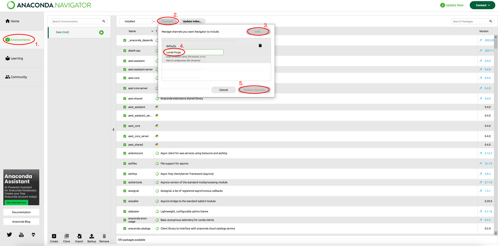
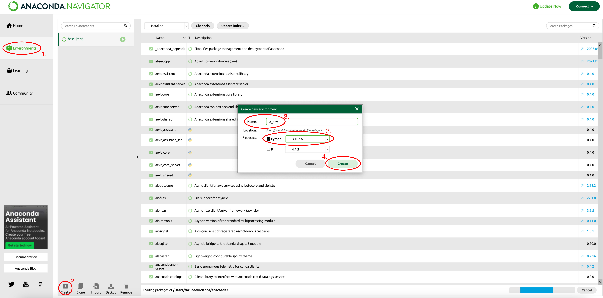

# Modo Novato 🙂

Para poder programar en Python, primero debemos preparar nuestra máquina con las herramientas adecuadas.

A lo largo de la materia, necesitaremos:

* **Una versión específica de Python:** Las distintas librerías tienen compatibilidad con versiones precisas del lenguaje.
* **Un gestor de paquetes:** Para instalar, actualizar y organizar las librerías necesarias de forma automática.
* **Entornos virtuales aislados:** Para evitar conflictos. No todos nuestros proyectos usarán los mismos paquetes o la misma versión de Python.

> [!WARNING]
> **Importante:** No es recomendable utilizar la versión de Python que viene preinstalada en tu sistema operativo (especialmente en Linux o macOS), ya que modificar sus paquetes base podría afectar el funcionamiento de todo el sistema.

---

### 🟢 Introducción a Anaconda

La forma más sencilla de solucionar todos estos requerimientos en Data Science es utilizando **Anaconda**.

[Anaconda](https://www.anaconda.com/) es una distribución de Python y R orientada específicamente a la computación científica (ciencia de datos, aprendizaje automático, etc.). Está diseñada para simplificar enormemente el despliegue y administración de los paquetes de software. Utiliza un sistema propio llamado **_conda_** para gestionar todo esto. Está disponible para Linux, macOS y Windows.

> [!NOTE]
> ### 🐍 Paso 1: Instalación de Anaconda
> A continuación tienes un video guía para dejar todo listo y funcionando en tu computadora:
> 
> 📺 **[Instalación de Anaconda (Video de YouTube)](https://youtu.be/lMOQotvwXG4)**
> 
> **Resumen de pasos:**
> 1. Si deseas registrarte para acceder a beneficios, ingresa a la sección de descargas oficiales en [anaconda.com/download](https://www.anaconda.com/download). Si prefieres descargar directamente sin registrarte, puedes ir a [repo.anaconda.com/archive](https://repo.anaconda.com/archive).
> 2. Descarga el instalador gráfico correspondiente a tu sistema operativo (Windows o macOS con procesador Intel/M1).
> 3. Ejecuta el archivo descargado y sigue el asistente usando las opciones por defecto.
> 
> *Nota: Si usas Linux o prefieres la línea de comandos en Mac, puedes instalarlo vía terminal, o elegir [Miniconda](https://docs.conda.io/en/latest/miniconda.html) si buscas una opción mucho más liviana.*

---

### 📦 Gestión de Entornos y Paquetes

Conda puede usarse de dos maneras: a través de su interfaz gráfica llamada **Anaconda Navigator**, o directamente a través de la **línea de comandos (terminal)**. A continuación, detallamos la forma recomendada para la materia.

#### ⚙️ Método Recomendado: Línea de Comandos

Administrar Anaconda mediante la consola es la forma más rápida y el estándar de la industria, ya que permite automatizar tareas e integrarlo en procesos en la nube.

📺 **[Crear entorno de desarrollo con Conda desde terminal (YouTube)](https://youtu.be/aleIuvShZi4)**

> [!TIP]
> ### 🌟 Instalar entorno a partir del archivo YAML (Opción ideal)
> Este repositorio incluye un archivo preconfigurado (`env_anaconda_shareable.yml`) con todas las librerías y versiones que utilizaremos a lo largo de la materia (Jupyter, Pandas, Scikit-Learn, Pygame, etc.).
> 
> Para crear el entorno idéntico, solo ejecuta estos comandos secuencialmente en tu terminal:
> 
> 1. Posiciónate en la carpeta donde clonaste el repositorio:
>    ```bash
>    cd ruta/a/tu/carpeta/intro_ia
>    ```
> 2. Crea el entorno usando el archivo YML:
>    ```bash
>    conda env create -f env_anaconda_shareable.yml
>    ```
> 3. Activa el nuevo entorno:
>    ```bash
>    conda activate ia_env
>    ```

_(Opcional)_ Si prefieres crear y configurar tu entorno paso a paso de forma manual:

**1. Agregar el canal de la comunidad (conda-forge):**
```bash
conda config --add channels conda-forge
```
**2. Crear el entorno:**
```bash
conda create -n ia_env python=3.12
```
**3. Activar el entorno:**
```bash
conda activate ia_env
```
**4. Instalar librerías:**
```bash
conda install -y jupyter pandas scikit-learn
```

---

<details>
<summary>🖼️ Alternativa con Interfaz Gráfica: Anaconda Navigator</summary>

Si prefieres no usar la terminal, puedes administrar todo desde **Anaconda Navigator**.

**Agregar el repositorio conda-forge:**
1. Ve a la pestaña **Environments** y haz clic en **Channels**.
2. Haz clic en **Add...**, escribe _conda-forge_ y presiona Enter.
3. Haz clic en **Update channels**.



📺 **[Crear entorno virtual desde Navigator (YouTube)](https://youtu.be/DmEKSS8RQjk)**

**Configurar el entorno manualmente:**
1. Haz clic en **Create** (abajo), nombra el entorno e indica la versión de Python (ej. 3.12).
2. En la lista a la derecha, marca la opción "Not installed" para buscar paquetes nuevos.
3. Busca e instala las librerías necesarias una por una (_jupyter, numpy, pandas, scipy, matplotlib, seaborn, scikit-learn, pygame, ipykernel_) haciendo clic en **Apply**.



</details>

---

**📚 Referencias oficiales:**
* [Documentación oficial de Conda](https://docs.conda.io/projects/conda/en/stable/user-guide/index.html)
* [Guía inicial de Anaconda Navigator](https://www.anaconda.com/docs/tools/anaconda-navigator/getting-started)
