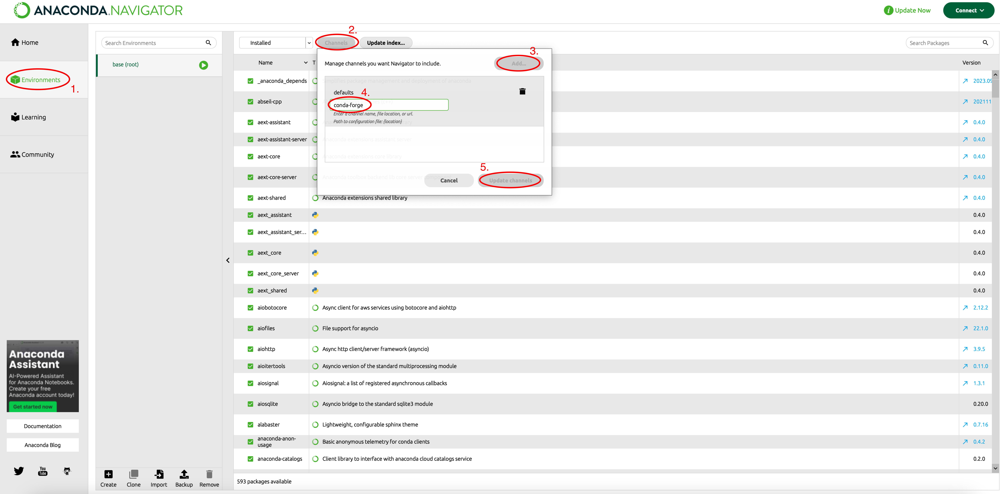
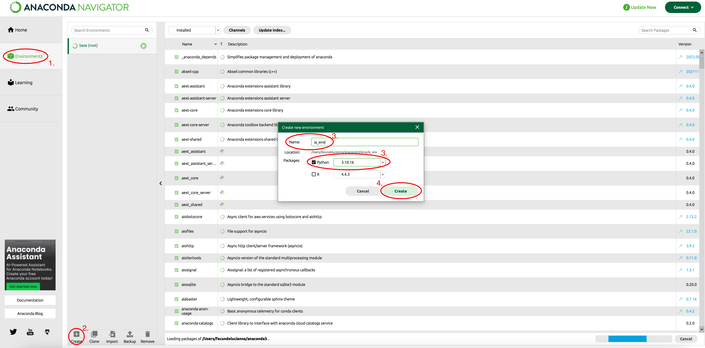

# Modo Novato 🙂

Para poder programar en Python, primero debemos preparar nuestra máquina con las herramientas adecuadas.

A lo largo de la materia, necesitaremos:

* **Una versión específica de Python:** Las distintas librerías tienen compatibilidad con versiones precisas del lenguaje.
* **Un gestor de paquetes:** Para instalar, actualizar y organizar las librerías necesarias de forma automática.
* **Entornos virtuales aislados:** Para evitar conflictos. No todos nuestros proyectos usarán los mismos paquetes o la misma versión de Python.

> [!WARNING]
> **Importante:** No es recomendable utilizar la versión de Python que viene preinstalada en tu sistema operativo (especialmente en Linux o macOS), ya que modificar sus paquetes base podría afectar el funcionamiento de todo el sistema.

---

### 🟢 Introducción a Anaconda

La forma más sencilla de solucionar todos estos requerimientos en Data Science es utilizando **Anaconda**.

[Anaconda](https://www.anaconda.com/) es una distribución de Python y R orientada específicamente a la computación científica (ciencia de datos, aprendizaje automático, etc.). Está diseñada para simplificar enormemente el despliegue y administración de los paquetes de software. Utiliza un sistema propio llamado **_conda_** para gestionar todo esto. Está disponible para Linux, macOS y Windows.

> [!NOTE]
> ### 🐍 Paso 1: Instalación de Anaconda
> A continuación tienes un video guía para dejar todo listo y funcionando en tu computadora:
> 
> 📺 **[Instalación de Anaconda (Video de YouTube)](https://youtu.be/lMOQotvwXG4)**
> 
> **Resumen de pasos:**
> 1. Si deseas registrarte para acceder a beneficios, ingresa a la sección de descargas oficiales en [anaconda.com/download](https://www.anaconda.com/download). Si prefieres descargar directamente sin registrarte, puedes ir a [repo.anaconda.com/archive](https://repo.anaconda.com/archive).
> 2. Descarga el instalador gráfico correspondiente a tu sistema operativo (Windows o macOS con procesador Intel/M1).
> 3. Ejecuta el archivo descargado y sigue el asistente usando las opciones por defecto.
> 
> *Nota: Si usas Linux o prefieres la línea de comandos en Mac, puedes instalarlo vía terminal, o elegir [Miniconda](https://docs.conda.io/en/latest/miniconda.html) si buscas una opción mucho más liviana.*

---

> [!IMPORTANT]
> ### 🖥️ ¿Qué terminal tengo que abrir?
> Antes de seguir, ojo con este detalle, porque es el error más común:
>
> * **Windows:** buscá **"Anaconda Prompt"** en el menú Inicio y abrí esa. Los comandos de `conda` **no funcionan** en PowerShell ni en el Símbolo del sistema (CMD) si instalaste Anaconda con las opciones por defecto: te va a responder `'conda' no se reconoce como un comando interno o externo`. Es la ventana que se ve en los videos.
> * **macOS:** abrí la aplicación **Terminal** (Aplicaciones → Utilidades, o buscándola con Spotlight). En Mac no existe el "Anaconda Prompt": el instalador deja `conda` configurado directamente en la Terminal, así que los comandos son los mismos aunque la ventana se vea distinta a la de los videos.
> * **Linux:** cualquier terminal sirve.

---

### 📦 Gestión de Entornos y Paquetes

Conda puede usarse de dos maneras: a través de su interfaz gráfica llamada **Anaconda Navigator**, o directamente a través de la **línea de comandos (terminal)**. A continuación, detallamos la forma recomendada para la materia.

#### ⚙️ Paso 2: Crear el entorno · Método Recomendado (Línea de Comandos)

Administrar Anaconda mediante la consola es la forma más rápida y el estándar de la industria, ya que permite automatizar tareas e integrarlo en procesos en la nube.

📺 **[Crear entorno de desarrollo con Conda desde terminal (YouTube)](https://youtu.be/aleIuvShZi4)**

> [!TIP]
> ### 🌟 Instalar entorno a partir del archivo YAML (Opción ideal)
> Este repositorio incluye un archivo preconfigurado (`env_anaconda_shareable.yml`) con todas las librerías y versiones que utilizaremos a lo largo de la materia (Jupyter, Pandas, Scikit-Learn, Pygame, etc.).
> 
> Para crear el entorno idéntico, solo ejecuta estos comandos secuencialmente en tu terminal:
> 
> 1. Posiciónate en la carpeta donde descargaste o clonaste el repositorio:
>    ```bash
>    cd ruta/a/tu/carpeta/intro_ia
>    ```
>    💡 **Truco:** no escribas la ruta a mano. Escribí `cd` seguido de un espacio y después **arrastrá la carpeta del repositorio** desde el Explorador de Windows (o el Finder en macOS) hasta la ventana de la terminal: la ruta se pega sola y bien escrita, aunque tenga espacios o acentos. Recién ahí apretá Enter.
> 2. Crea el entorno usando el archivo YML:
>    ```bash
>    conda env create -f env_anaconda_shareable.yml
>    ```
>    Este paso descarga e instala bastantes librerías, así que puede tardar varios minutos. Que la terminal parezca congelada un rato es normal.
> 3. Activa el nuevo entorno:
>    ```bash
>    conda activate ia_env
>    ```

> [!NOTE]
> ### ✅ ¿Cómo sé que funcionó?
> Si todo salió bien, al principio de la línea de la terminal ahora aparece el nombre del entorno entre paréntesis:
>
> ```
> (ia_env) C:\Users\tu_usuario\intro_ia>
> ```
>
> Mientras veas `(ia_env)`, todo lo que instales o ejecutes ocurre dentro del entorno de la materia. Tené en cuenta que esto **no es permanente**: cada vez que cierres y vuelvas a abrir la terminal, tenés que ejecutar `conda activate ia_env` otra vez.
>
> **Y ahora, ¿qué hago con esto?** Con el entorno activo ya podés levantar Jupyter, que es donde vamos a trabajar durante toda la materia:
>
> ```bash
> jupyter lab
> ```
>
> Se te va a abrir solo en el navegador. Para conocer Jupyter en detalle, seguí con la 👉 **[Guía de instalación de Jupyter Notebook](./jupyter_installation.md)**.

---

#### 🎓 Camino didáctico: armar un entorno desde cero

Todo lo de arriba es el **camino operativo**: lo que necesitás para cursar. Lo que sigue es el **camino didáctico**, para entender qué está haciendo conda por debajo cuando lee el archivo YML.

> [!WARNING]
> Este procedimiento crea un entorno **incompleto a propósito**: instala solo algunas librerías de ejemplo, no todas las que usa la materia. Sirve para aprender el mecanismo, pero para cursar creá el entorno con el archivo YML como se explica más arriba.
>
> Además, si ya creaste `ia_env` con el archivo YML, ponele **otro nombre** a este entorno de práctica (por ejemplo `prueba_env`) para no pisar el que ya te funciona.

_(Opcional)_ Si prefieres crear y configurar tu entorno paso a paso de forma manual:

**1. Agregar el canal de la comunidad (conda-forge):**
```bash
conda config --add channels conda-forge
```
**2. Crear el entorno:**
```bash
conda create -n ia_env python=3.12
```
**3. Activar el entorno:**
```bash
conda activate ia_env
```
**4. Instalar librerías:**
```bash
conda install -y jupyter pandas scikit-learn
```

---

<details>
<summary>🖼️ Alternativa con Interfaz Gráfica: Anaconda Navigator</summary>

Si prefieres no usar la terminal, puedes administrar todo desde **Anaconda Navigator**, que se instala junto con Anaconda y se abre desde el menú Inicio (Windows) o el Launchpad (macOS). Es la opción más cómoda si la consola se te hace cuesta arriba.

#### ⭐ Opción rápida: importar el archivo YML

Equivale exactamente al `conda env create -f env_anaconda_shareable.yml` del camino por terminal: te deja el mismo entorno, con el mismo nombre y las mismas librerías, sin escribir un solo comando.

1. Abrí Anaconda Navigator y andá a la pestaña **Environments**.
2. Abajo de la lista de entornos, hacé clic en **Import**.
3. En *Local drive*, seleccioná el archivo `env_anaconda_shareable.yml` que está en la carpeta del repositorio y confirmá con **Import**.

Cuando termine (puede tardar varios minutos), `ia_env` va a aparecer en la lista. Después andá a la pestaña **Home**, elegí `ia_env` en el desplegable de arriba y lanzá **JupyterLab**.

Con esto ya estás listo para cursar: **no necesitás seguir los pasos de más abajo**.

---

#### 🎓 Camino didáctico: crear el entorno a mano

Lo que sigue arma un entorno desde cero con la interfaz gráfica. Es el equivalente visual del "camino didáctico" de la consola, y es lo que se muestra en el video.

> [!WARNING]
> Igual que en la versión por consola, este camino instala **solo algunas** de las librerías de la materia. Para cursar, usá la opción de **Import** de más arriba.

**Agregar el repositorio conda-forge:**
1. Ve a la pestaña **Environments** y haz clic en **Channels**.
2. Haz clic en **Add...**, escribe _conda-forge_ y presiona Enter.
3. Haz clic en **Update channels**.



📺 **[Crear entorno virtual desde Navigator (YouTube)](https://youtu.be/DmEKSS8RQjk)**

**Configurar el entorno manualmente:**
1. Haz clic en **Create** (abajo), nombra el entorno e indica la versión de Python (ej. 3.12).
2. En la lista a la derecha, marca la opción "Not installed" para buscar paquetes nuevos.
3. Busca e instala las librerías necesarias una por una (_jupyter, numpy, pandas, scipy, matplotlib, seaborn, scikit-learn, pygame, ipykernel_) haciendo clic en **Apply**.



</details>

---

**📚 Referencias oficiales:**
* [Documentación oficial de Conda](https://docs.conda.io/projects/conda/en/stable/user-guide/index.html)
* [Guía inicial de Anaconda Navigator](https://www.anaconda.com/docs/tools/anaconda-navigator/getting-started)
