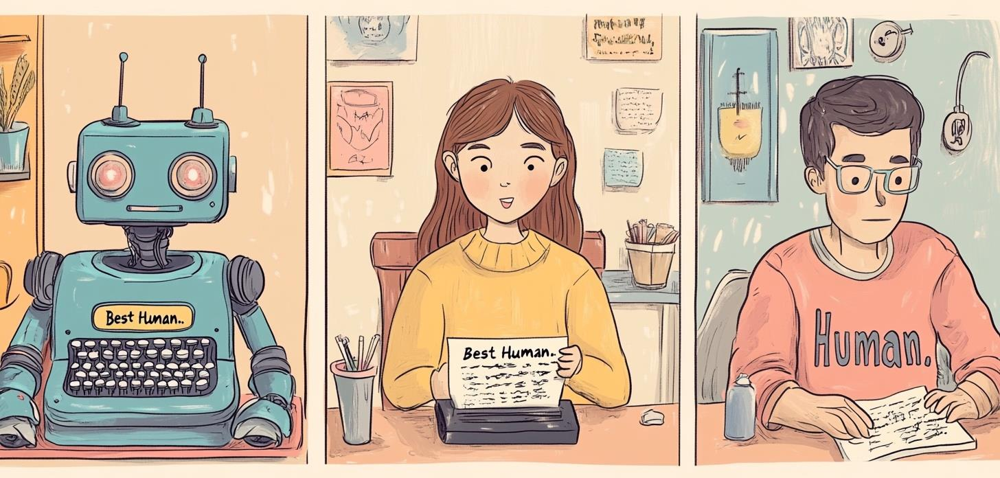
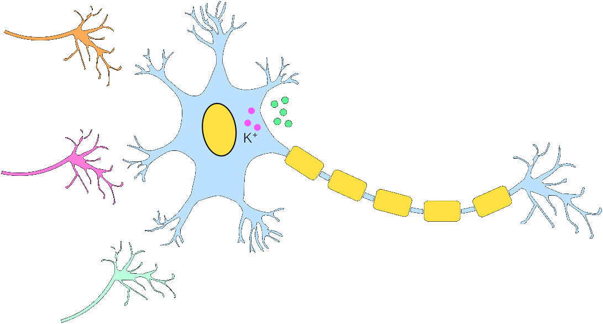
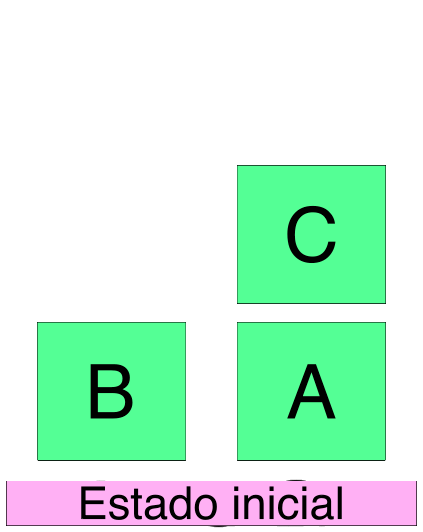

# Clase 1: Introducción a la Inteligencia Artificial

  
  
  **Dr. Ing. Facundo Adrián Lucianna | CEIA - FIUBA**

---

## 📖 Información General

- **Aula virtual:** [Campus Posgrado FIUBA](https://campusposgrado.fi.uba.ar/course/view.php?id=253)
- **Repositorio de la materia:** [GitHub - intro_ia](https://github.com/FIUBA-Posgrado-Inteligencia-Artificial/intro_ia)
- **Consultas:** Foro de consulta en el aula virtual
- **Correo:** Facundo Adrián Lucianna (facundolucianna@gmail.com)

---

## 🤖 ¿Qué es la Inteligencia Artificial?

La primera pregunta que nos hacemos es qué es la **Inteligencia Artificial (IA)**. Como siempre en estos campos de vanguardia, no hay una sola definición.

Según **Stuart Russell** y **Peter Norvig**:
- A veces se define en función de:
  - La **fidelidad del desempeño humano** (u otro animal).
  - Hacer **“lo correcto”** (racionalidad).
- También se considera una propiedad:
  - De los procesos de **pensamiento y razonamiento internos**.
  - Del **comportamiento**, es decir, una característica externa.

---

## 🗣️ Actuando Humanamente: El Test de Turing

  

Programar un software para pasar rigurosamente el test implica un gran trabajo. Este software debe contar con las siguientes capacidades:

1. **Procesamiento de lenguaje natural:** Para comunicarse exitosamente en un lenguaje humano.
2. **Representación del conocimiento:** Para almacenar lo que conoce o escucha.
3. **Razonamiento automático:** Para responder a las preguntas y obtener nuevas conclusiones.
4. **Aprendizaje automático:** Para adaptarse a las nuevas circunstancias y detectar y extrapolar patrones.

---

## 🧠 Pensando Racionalmente

El filósofo **Aristóteles** fue el primero en intentar codificar “pensar correctamente”. Sus **silogismos** proveyeron un patrón para estructuras argumentales que siempre llevan a conclusiones correctas dadas unas premisas correctas:

> *"Sócrates es un hombre y todos los hombres son mortales, entonces Sócrates es mortal."*

- Estas leyes de pensamiento derivaron en el campo de la **lógica**.
- En el siglo XVIII se desarrolló una notación precisa para los enunciados sobre los objetos del mundo y las relaciones entre ellos.
- Para 1965, programadores pudieron resolver informáticamente cualquier problema de lógica resoluble usando esta notación.

### El problema de la incertidumbre

La lógica pura espera que el conocimiento del mundo sea cierto, pero sabemos que **el mundo está regido por la incertidumbre**.

La **teoría de probabilidad** llena este vacío, permitiendo un razonamiento riguroso con información incierta. Esto nos permite construir un modelo de pensamiento racional, desde la percepción hasta la comprensión de cómo funciona el mundo y hacer predicciones.

Sin embargo, esto no genera comportamientos inteligentes por sí solo, ya que con solo pensar no alcanza: **necesitamos actuar**.
> *¿"Pienso, luego existo" ya no vale más?*

---

## ⚙️ Agentes Racionales y el Modelo Estándar

Un **agente** es algo que actúa. Se espera que opere de forma autónoma, perciba el ambiente, persista en el tiempo, se adapte y cumpla objetivos.

- **Agente racional:** Aquel que llega al mejor escenario, o en caso de incertidumbre, al mejor escenario esperado.
- **Modelo estándar:** La IA se ha enfocado en el estudio y construcción de agentes que "hacen lo correcto", siendo esto definido por el objetivo que proveemos al agente. 

Este modelo ha sido predominante en IA, así como en teoría del control, estadística y economía.

---

## 🎯 Máquinas Beneficiosas y el Problema de Alineación

El modelo estándar asume que se va tras un objetivo específico. En la vida real, especificar un objetivo de manera completa y correcta es extremadamente difícil.

  

El balance entre nuestras preferencias y el objetivo de la máquina se conoce como el **problema de alineación de valores**. Los objetivos de la máquina deben estar alineados con los de la humanidad.

- En un laboratorio, si algo sale mal, simplemente reseteamos el sistema.
- En la vida real esto a veces no es posible. 

Por esto, el modelo estándar requiere una advertencia: cuando una máquina sabe que no conoce el objetivo completo, tiene el incentivo de **actuar con cautela, pedir permiso, aprender de nuestras preferencias (observación) y ceder el control al humano**.

  

---

## 🔗 Campos Conectados

  

---

## 📜 Historia de la IA

### 1. El Principio de la IA (1943 - 1956)

El primer trabajo reconocido de IA fue desarrollado por **Warren McCulloch** y **Walter Pitts** (1943): presentaban un modelo de neuronas artificiales con estados binarios (prender/apagar) en respuesta a estímulos vecinos.

Posteriormente, **Donald Hebb** (1949) propuso una regla para modificar la intensidad de la conexión entre neuronas (aprendizaje), que sigue vigente hoy.

  

**Alan Turing** (1947) dio sus primeras lecciones sobre IA introduciendo el *Test de Turing*, aprendizaje automático, algoritmos genéticos y aprendizaje por refuerzo. Sugirió que sería más fácil crear una IA con aprendizaje automático que programando su conocimiento a mano.

  

---

### 2. Entusiasmo Inicial y Grandes Expectativas (1952 - 1969)

En los años 50 se solía decir "*una máquina nunca podrá hacer X*". Los investigadores respondieron logrando progresivamente que las máquinas resolvieran juegos, rompecabezas, problemas matemáticos y pruebas IQ.

- **Arthur Samuel** (1956): Creó un programa de damas con aprendizaje por refuerzo, capaz de aprender por sí solo.

  

- **John McCarthy** (1958): Creó `Lisp` (el lenguaje dominante de la IA por 30 años) y conceptualizó el *Advice Taker*, un programa hipotético dotado de conocimiento general del mundo.
- **Marvin Minsky** (1963-1969): Supervisó el desarrollo de "micromundos". El más famoso de ellos es el **Mundo de Bloques**.
  > *Objetivo:* Apilar bloques verticalmente, moviendo uno a la vez. No se puede mover un bloque si tiene otro encima.

  
  

---

### 3. El Primer Invierno (1966 - 1973)

**Herbert Simon** (1957) pronosticó que, en 10 años, una IA vencería al campeón mundial de ajedrez y probaría teoremas matemáticos complejos. **Esto demoró 40 años.**

  

El fracaso y las "sobre-expectativas" tuvieron dos motivos principales:
1. Basaban sus algoritmos en **introspección informada** (cómo creen que razona un humano).
2. Faltaba una teoría sólida de **complejidad algorítmica**; se desconocía cómo escalaban los sistemas.

Además, el libro *Perceptrones* (1969) de Minsky y Papert demostró que los perceptrones simples no podían resolver problemas como la función *XOR*. Esto paralizó el desarrollo del *Deep Learning* por 15 años.

---

### 4. Sistemas Expertos (1969 - 1986)

Surgieron como la primera aplicación comercial exitosa de la IA. Por ejemplo, el programa **DENDRAL** (1969) infería estructuras moleculares, programado con reglas lógicas rígidas introducidas por expertos humanos para evitar búsquedas innecesarias.

Esto condujo a un segundo "invierno de la IA", esta vez enfocado en el área comercial por la dificultad de mantener dichos sistemas.

  

---

### 5. El Retorno de las Redes Neuronales (1986 - Presente)

En los 80s se redescubrió el algoritmo de **back-propagation**, que permitió finalmente entrenar redes neuronales multicapa.
**Geoff Hinton**, uno de los pioneros, cuestionó el enfoque tradicional y señaló que los símbolos representativos eran "el éter de la IA", abriendo paso a la nueva era.

---

### 6. Aprendizaje Automático (1987 - Presente)

La IA adoptó un enfoque más científico, validable y estadístico. Regresó el uso de conceptos de **teoría de la probabilidad, teoría del control y optimización**.
En este periodo ganaron protagonismo modelos eficientes y con mejores resultados que las redes neuronales simples, como las **Cadenas de Markov, Redes Bayesianas y Máquinas de Vectores de Soporte (SVM)**.

---

### 7. Big Data y Deep Learning (2001 - Presente)

La expansión de la World Wide Web y las mejoras en procesamiento propiciaron el **Big Data**, grandes conjuntos de datos que permitieron explotar el **Aprendizaje Automático**. Un ejemplo de este resurgimiento fue en 2011, cuando **IBM Watson** venció a campeones humanos en el juego *Jeopardy!*.

Finalmente, el **Deep Learning** reavivó a las redes neuronales, alcanzando avances enormes en múltiples áreas gracias a:
- La capacidad del hardware moderno (**GPU, TPU, FPGA**) para procesar tensores en paralelo (10^17 operaciones por segundo).
- Datos al nivel de **Petabytes** listos para entrenar arquitecturas profundas.

  

---

## ⚖️ Beneficios y Riesgos de la IA

### Beneficios
La civilización entera es producto de la inteligencia humana, y las máquinas inteligentes pueden elevar este potencial a niveles insospechados:
- Eliminación de tareas tediosas o repetitivas para la humanidad.
- Aceleración masiva de la investigación científica.
- *¿Qué otros beneficios se te ocurren?*

  

---

### Riesgos

- Armas letales autónomas.
- Vigilancia y persuasión masiva (*al estilo 1984*).
- Toma de decisiones sesgadas (bias algorítmico).
- Fuerte impacto en los empleos.
- Fallos de implementación en aplicaciones críticas de seguridad (p. ej. vehículos autónomos, medicina).
- Problemas de ciberseguridad.

  

