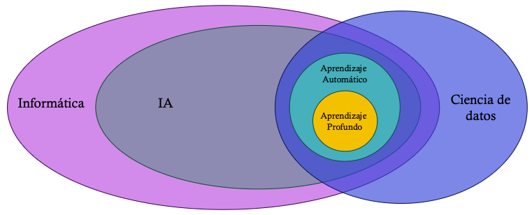
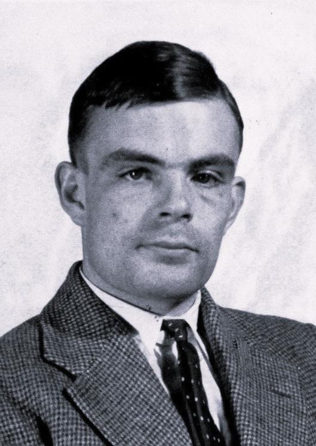
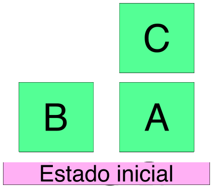
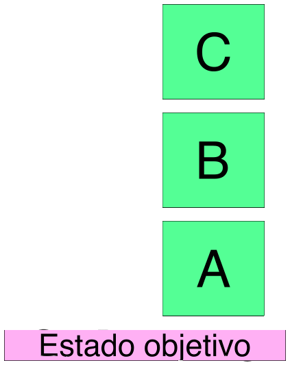
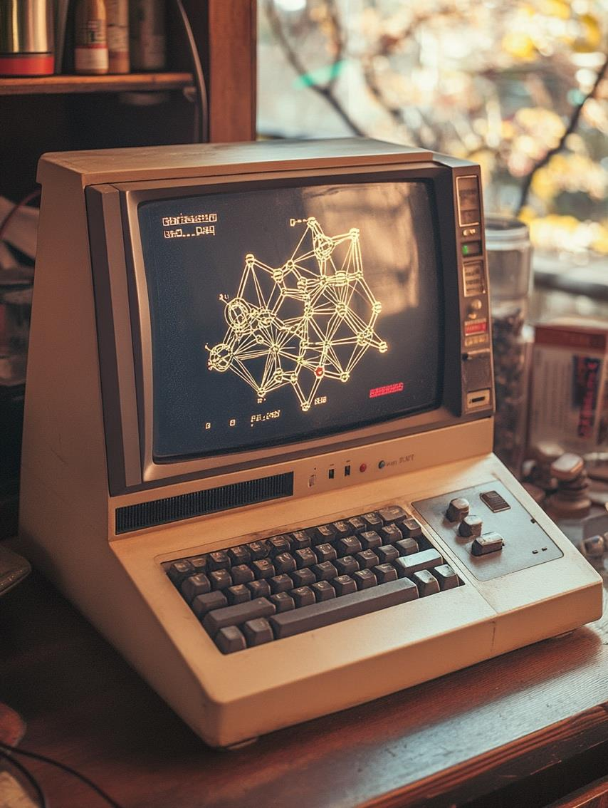
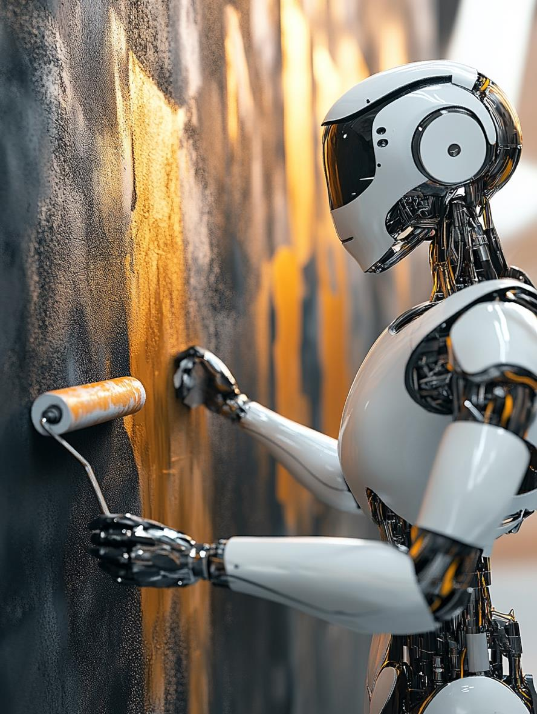

# Clase 1 - Introducción a la Inteligencia Artificial

---

## Diapositiva 1
**Introducción**

**Inteligencia Artificial**

Dr. Ing. Facundo Adrián Lucianna - CEIA - FIUBA

---

## Diapositiva 2: Introducción

**Aula virtual:**
* https://campusposgrado.fi.uba.ar/course/view.php?id=253

**Repositorio de la materia:**
* https://github.com/FIUBA-Posgrado-Inteligencia-Artificial/intro_ia

**Consultas**
* Foro de consulta en el aula virtual

**Correo**
* Facundo Adrián Lucianna: [EMAIL_ADDRESS]

---

## Diapositiva 3
**Inteligencia Artificial**

---

## Diapositiva 4: Inteligencia Artificial

* La primera pregunta que nos hacemos es qué es la **Inteligencia Artificial (IA)**
* Como siempre en estos campos de vanguardia, no hay una sola definición.
* Según Stuart Russell y Peter Norvig:
  * A veces se define en función de:
    * La fidelidad del desempeño humano (u otro animal)
    * Hacer “lo correcto” (racionalidad)
  * También se considera una propiedad:
    * De los procesos de pensamiento y razonamiento internos.
    * Del comportamiento, es decir una característica externa.

---

## Diapositiva 5: Inteligencia Artificial
**Actuando humanamente – El test de Turing**

---

## Diapositiva 6: Inteligencia Artificial
**Actuando humanamente: El test de Turing**

Programar un software para pasar rigurosamente el test implica un gran trabajo. Este software debe contar con las siguientes capacidades:
* **Procesamiento natural del lenguaje** para comunicarse exitosamente en un lenguaje humano.
* **Representación de conocimiento** para almacenar lo que conoce o escucha.
* **Razonamiento automático** para responder a las preguntas y obtener nuevas conclusiones.
* **Aprendizaje automático** para adaptarse a las nuevas circunstancias y para detectar y extrapolar patrones.

---

## Diapositiva 7: Inteligencia Artificial
**Pensando racionalmente**

El filósofo Aristóteles fue el primero en intentar codificar “pensar correctamente”.

Sus **silogismos** proveyeron un patrón para estructuras argumentales que siempre llevan a conclusiones correctas dados unas premisas correctas.

> “Sócrates es un hombre y todos los hombres son mortales entonces Sócrates es mortal”

Estas leyes de pensamiento derivaron en el campo de la **lógica**.

En el siglo XVIII se desarrolló una notación precisa para los enunciados sobre los objetos del mundo y las relaciones entre ellos.

Para 1965, programadores pudieron resolver informáticamente cualquier problema de lógica resoluble usando la notación lógica.

---

## Diapositiva 8: Inteligencia Artificial
**Pensando racionalmente**

La lógica espera que el conocimiento del mundo sea cierto… algo que sabemos que no es así, el mundo es regido por la incertidumbre.

La teoría de probabilidad llena este vacío, permitiendo un razonamiento riguroso con información incierta.

Esto nos permite construir un modelo de pensamiento racional (desde la percepción hasta la comprensión de cómo funciona el mundo y hacer predicciones).

Pero esto no genera comportamientos inteligentes, ya que con solo pensar no nos alcanza, necesitamos actuar.

> ”¿Pienso, luego existo” ya no vale más?

---

## Diapositiva 9: Inteligencia Artificial
**Pensando racionalmente**

Un agente es algo que actúa. Un agente se espera que opere autónomamente, perciba el ambiente, persista sobre un tiempo prolongado, se adapte y cree y cumpla objetivos.

**Un agente racional** es aquel que llega al mejor escenario, o si hay incertidumbre, al mejor escenario esperado.

IA se ha enfocado en el estudio y construcción de agentes que hacen lo correcto. Qué cuenta por hacer lo correcto es el objetivo que le proveemos al agente. Esto se llama el **modelo estándar**.

Este modelo no solo ha sido predominante en IA, sino además en *teoría del control*, en *estadística*, y *economía*.

---

## Diapositiva 10: Inteligencia Artificial
**Máquinas beneficiosas**

El modelo estándar asume que se va a un objetivo específico a resolver… algo que, en la vida real, es mucho más difícil especificar el objetivo completamente y correctamente.

---

## Diapositiva 11: Inteligencia Artificial
**Máquinas beneficiosas**

---

## Diapositiva 12: Inteligencia Artificial
**Máquinas beneficiosas**

El balance de lograr un acuerdo entre nuestras preferencias y el objetivo que tiene la maquina se llama problema de alineación de valores.

Los valores u objetivos que damos a una máquina deben estar alineados con los del ser humano.

Si estamos en un laboratorio, hay una forma fácil de solucionar esto, resetear el sistema.

En la vida real, esto no es posible. Por lo que el modelo estándar no es apropiado. Se necesita una nueva formulación.

Cuando una máquina sabe que no conoce el objetivo completo, tiene un incentivo para actuar con cautela, pedir permiso, aprender más sobre nuestras preferencias a través de la observación y ceder al control humano.

---

## Diapositiva 13: Inteligencia Artificial
**Campos conectados**

---

## Diapositiva 14
**Historia de la IA**

---

## Diapositiva 15: Historia de la IA
**El principio de la inteligencia artificial (1943-1956)**

El primer trabajo reconocido de IA es el desarrollado por **Warren McCulloch** y **Walter Pitts** en 1943.

Modelo de neurona artificial en el cual cada una se puede prender o apagar. Se prenden cuando responde a la estimulación de varias neuronas vecinas.

**Donald Hebb** (1949) creó una regla que permitía modificar la intensidad de conexión entre neuronas (aprendizaje). Este modelo sigue siendo válido hasta el día de hoy.

---

## Diapositiva 16: Historia de la IA
**El principio de la inteligencia artificial (1943-1956)**

**Alan Turing** dio sus primeras lecciones en IA en 1947.

Introdujo el test de Turing, aprendizaje automático, algoritmos genéticos y aprendizaje por refuerzo.

Sugirió que sería más fácil crear IA a nivel humano desarrollando algoritmos de aprendizaje y luego enseñando a la máquina en lugar de programar su inteligencia a mano.

---

## Diapositiva 17: Historia de la IA
**Entusiasmo inicial, grandes expectativas (1952-1969)**

En el establishment intelectual de 1950 regía *“una máquina nunca podrá hacer X”*.

Los investigadores de IA respondieron naturalmente demostrando una X tras otra (juegos, rompecabezas, matemáticas y pruebas de IQ).

---

## Diapositiva 18: Historia de la IA
**Entusiasmo inicial, grandes expectativas (1952-1969)**

**Arthur Samuel**, usando aprendizaje por refuerzo, creó un programa que podía jugar a las damas (1956). Es decir, el software aprendió por sí solo.

---

## Diapositiva 19: Historia de la IA
**Entusiasmo inicial, grandes expectativas (1952-1969)**

**John McCarthy** (1958) creó:
1. **Lisp**: El lenguaje de programación de IA durante 30 años.
2. **Advice Taker**: un programa hipotético que encarnaría el conocimiento general del mundo y podría utilizarlo para derivar planes de acción. El programa también fue diseñado para aceptar nuevos axiomas en el curso normal de operación, permitiéndole así alcanzar competencia en nuevas áreas sin ser reprogramado.

---

## Diapositiva 20: Historia de la IA
**Entusiasmo inicial, grandes expectativas (1952-1969)**

**Marvin Lee Minsky** en MIT supervisó a estudiantes que desarrollaron softwares en dominios limitados, llamados micro mundos (1963-1969).

El micro mundo más famoso es el **mundo de bloques**:

> El objetivo es construir una o más pilas verticales de bloques. Sólo se puede mover un bloque a la vez: puede colocarse sobre la mesa o encima de otro bloque. Debido a esto, cualquier bloque que esté, en un momento dado, debajo de otro bloque no se puede mover. Además, algunos tipos de bloques no pueden tener otros bloques apilados encima.

---

## Diapositiva 21: Historia de la IA
**Primer invierno (1966-1973)**

**Herbert Simon (1957)** predijo que en 10 años con IA se iba a lograr batir al campeón mundial de ajedrez, y resolver teoremas matemáticos complejos… *cosas que demoraron 40 años*.

El problema de estas sobre-expectativas son por dos motivos:
* Algoritmos de ese momento se basaban en **introspección informada** en cómo los humanos realizan una tarea.
* No se habían desarrollado las teorías computacionales de **complejidad algorítmica**, por lo que no se sabía cómo escalaban los algoritmos.

---

## Diapositiva 22: Historia de la IA
**Primer invierno (1966-1973)**

En el libro de Minsky y Papert, llamado **Perceptrones** (1969) se probó que los perceptrones (modelo de neurona), podían representar muy pocas funciones, principalmente la función lógica XOR.

Esto mató todo desarrollo de Deep Learning y neurociencia computacional durante 15 años.

---

## Diapositiva 23: Historia de la IA
**Sistemas expertos (1969-1986)**

Ante la falla de los algoritmos desarrollados previamente, principalmente por su imposibilidad de escalar, llegaron los sistemas expertos, la primera aplicación exitosa de IA.

El primer sistema experto fue el programa **DENDRAL** (1969) el cual infería estructuras moleculares, pero para poder resolver le introdujeron reglas de expertos químicos para evitar búsquedas innecesarias.

Luego otro invierno de IA, pero esta vez comercial.

---

## Diapositiva 24: Historia de la IA
**El retorno de las redes neuronales (1986-presente)**

En los 80, se re-descubrió el algoritmo de aprendizaje back-propagation, tarea fundamental para que las redes se entrenaran.

**Geoff Hinton**, uno de los principales impulsores de la vuelta de las redes neuronales, describió a los símbolos como el “éter de la IA”. Siendo la primera vez que se puso en discusión la idea de que la inteligencia se trataba de símbolos representativos que los primeros modelos de IA tenían en cuenta.

---

## Diapositiva 25: Historia de la IA
**Aprendizaje Automático (1987-presente)**

Durante los finales de los ‘80, IA tomó un enfoque más científico que previamente, se alejó de conceptos filosóficos y lógica booleana, para usar probabilidad y experimentos validables.

Esto llevó a que IA vuelva a tomar elementos de otras áreas de ciencias de las que se había alejado (partiendo de un mismo origen)… tales como estadística, teoría de control, teoría de la información, optimización, entre otros.

Esto llevó a la prevalencia del aprendizaje automático y al desarrollo de los modelos que hoy conocemos. Tales como **cadenas de Markov, redes bayesianas, máquinas de vectores de soporte**, etc.

Estos nuevos modelos fueron más importantes que los de redes neuronales, dado que se llegaban a mejores resultados, con mucho menos procesamiento.

---

## Diapositiva 26: Historia de la IA
**Big data (2001-presente)**

Con la llegada de la World Wide Web y mejoras en las computadoras (gracias a la ley de Moore), empezamos a tener datasets enormes, un fenómeno llamado big data.

Esto llevó a la necesidad de desarrollar algoritmos que tomen ventaja de este nuevo volumen de datos.

La disponibilidad de **Big Data** ayudó a aprendizaje automático y a IA a recuperar atractivo comercial. Con Big data se logró en 2011 que el sistema IBM Watson llegara a un nivel de campeón humano de Jeopardy!

---

## Diapositiva 27: Historia de la IA
**Deep Learning (2001-presente)**

Finalmente, con la llegada de Big Data, las redes neuronales, ahora con suficiente procesamiento como para lograr grandes redes y profundas, lograron explotar su potencial.

Se lograron enormes avances en casi cualquier área en la que se propusieran implementar estos algoritmos… finalmente con sistemas que son muy parecidos a estructuras nerviosas.

Deep Learning solo se pudo desarrollar en los últimos tiempos, cuando se lograron CPUs que pueden realizar 10^10 operaciones por segundo, o gracias al desarrollo de hardware específico (GPU, TPU o FPGA) para el procesamiento paralelo de tensores (10^17 operaciones/segundo). Y además gracias a Big Data con Petabytes de datos para entrenar.

---

## Diapositiva 28
**Beneficios y Riesgos de la IA**

---

## Diapositiva 29: Beneficios de la IA

* La entera civilización es el producto de la inteligencia humana. Las maquinas inteligentes nos pueden elevar este techo.
* Robots e IA pueden eliminar a la humanidad de tareas nimias.
* Puede acelerar investigaciones científicas.
* Y más, ¿Cuáles se les ocurren?

---

## Diapositiva 30: Riesgos de la IA

* Armas letales autónomas.
* Vigilancia y persuasión (a lo 1984).
* Toma de decisiones sesgadas.
* Impacto en empleos.
* Implementación en aplicaciones críticas en seguridad.
* Ciberseguridad.

