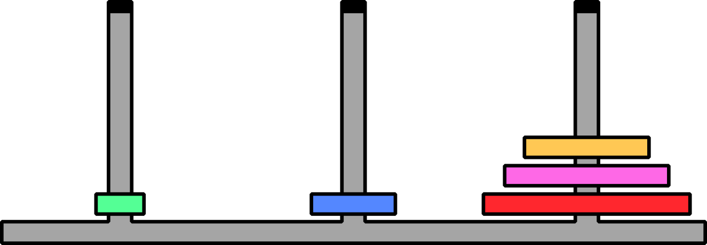
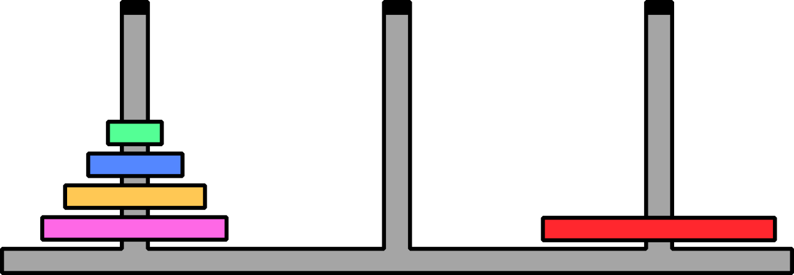
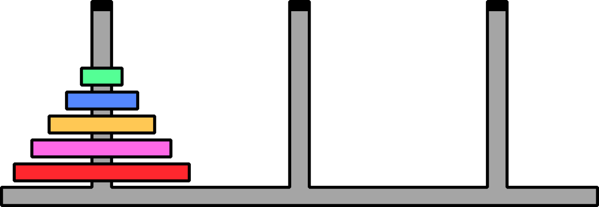

# Funciones heurísticas - Torre de Hanoi

Los algoritmos de búsqueda informada hacen uso de funciones heurísticas para estimar qué tan cerca o lejos se encuentran de la solución. El gran desafío es encontrar una buena heurística para el problema específico.

---

### 🧠 Una heurística para la Torre de Hanoi

Veamos una función heurística, `h(n)`, que podemos implementar para el caso del problema de la Torre de Hanoi:

> [!NOTE]
> ### 🎯 Regla Principal
> **`h(n)` bonifica con un punto negativo por cada disco ubicado en la posición correcta.**

Esta heurística funciona de la siguiente manera. Imaginemos que tenemos 5 discos, y los tres más grandes están en la posición correcta:

  

Entonces la heurística aquí es **`h(n) = -3`**

En cambio, si tenemos un solo disco en la posición correcta:

  

La heurística aquí es **`h(n) = -1`**

Y si estamos en el estado inicial, donde ningún disco está en la posición correcta:

  

La heurística aquí es **`h(n) = 0`**

---

### ➕ Evitando valores negativos

Recordemos que nuestros algoritmos de búsqueda se basan en valores donde cuanto más bajo sea el valor, mejor. **Usar números negativos nos permite reflejar esto.** 

Sin embargo, si por algún motivo prefieren evitar valores negativos, pueden reimplementar la heurística como:

**`h*(n) = h(n) + 5`**

En este caso, la nueva interpretación sería:

> [!CAUTION]
> ### ⚠️ Nueva Regla
> **`h*(n)` penaliza con un punto positivo por cada disco mal ubicado.**

Así, para los tres casos mencionados anteriormente, tendríamos:

* **`h*(n) = h(n) + 5 = -3 + 5 = 2`**
* **`h*(n) = h(n) + 5 = -1 + 5 = 4`**
* **`h*(n) = h(n) + 5 = 0 + 5 = 5`**

---

✨ Bonus: Heurística más sofisticada

Si desean usar otro tipo de heurística, ¡sean creativos! La creatividad es bienvenida y valorada.

Pueden explorar este artículo:

* 📘 [Garcia & Chávez R - Heuristic function in an algorithm of First-Best search for the problem of Tower of Hanoi: optimal route for n disks.](http://www.ptolomeo.unam.mx:8080/jspui/bitstream/132.248.52.100/15146/3/Art%C3%ADculo.pdf)

En dicho trabajo, se implementa una heurística basada en un análisis profundo del problema. Los autores estudian qué estrategias conducen a una solución eficiente y, a partir de eso, desarrollan un conjunto de reglas que se pueden traducir en una función heurística.

¿Alguna otra idea se les ocurre?

