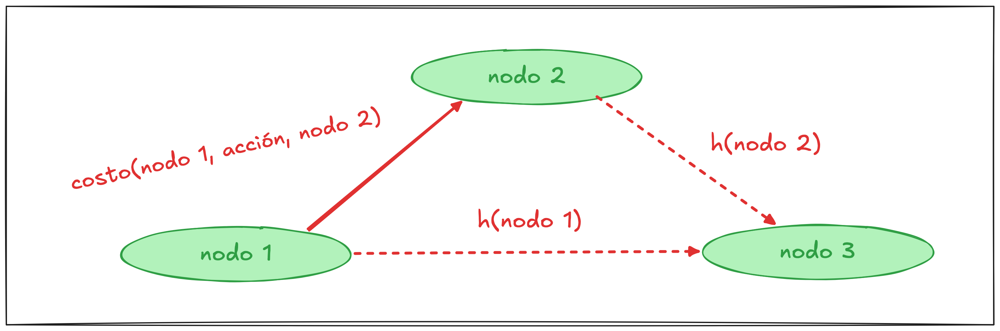
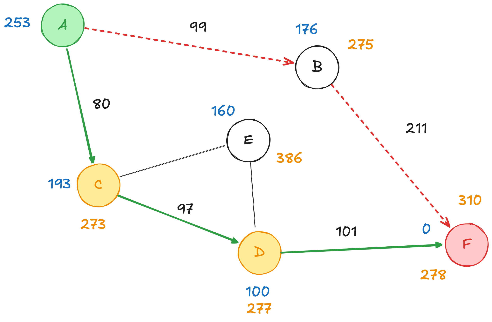

# Clase 2: Agentes y Resolución de Problemas

<div align="center">
  
  
  **Dr. Ing. Facundo Adrián Lucianna | CEIA - FIUBA**
</div>

---

## 🤖 Agentes Racionales

### Agente

<div align="center">
  
</div>

Una elección de acción de un agente en un momento dado puede depender en su conocimiento incorporado y en la secuencia completa de percepciones hasta ese instante, pero no en cualquier cosa que no haya percibido.

En términos matemáticos, el comportamiento del agente viene dado por la **función del agente** que mapea una percepción dada en una acción. En principio, con tiempo infinito, podemos construir una tabla que tabule cada acción dada una secuencia de percepción.

Es importante mantener estas dos ideas distintas:

- La **función del agente** es una descripción matemática abstracta.
- El **programa del agente** es una implementación concreta que se ejecuta dentro de algún sistema físico.

---

### Agente Aspiradora

<div align="center">
  
</div>

- **Percepción:** Espacio limpio / Espacio sucio
- **Acciones:** Mover a la izquierda, mover a la derecha, limpiar el espacio, no hacer nada

La tabla (parcial) de secuencia de percepción y acción:

| Secuencia de percepción | Acción |
|-------------------------|--------|
| [A, Limpio]             | Derecha |
| [A, Sucio]              | Limpiar |
| [B, Limpio]             | Izquierda |
| [B, Sucio]              | Limpiar |
| [A, Limpio], [A, Limpio] | Derecha |
| [A, Limpio], [A, Sucio] | Limpiar |
| ...                     | ... |

Un programa del agente para el ambiente de dos cajas:

```python
def REFLEX_VACUUM_AGENT(location, status) -> Action:
    if status == "Dirty":
        return Suck
    elif location == "A":
        return Right
    else: # location == "B"
        return Left 
```

---

### Medida de Rendimiento

Las medidas de rendimiento incluyen los criterios que determinan el éxito en el comportamiento del agente. Estos deben ser objetivos, y en general, determinados por el diseñador.

<div align="center">
  
</div>

> Un agente racional puede maximizar su medida de rendimiento de formas inesperadas. Por ejemplo, una aspiradora podría limpiar, tirar basura al suelo, limpiarla de nuevo, y así sucesivamente.

Como regla general, es mejor diseñar medidas de utilidad de acuerdo con lo que se quiere para el entorno, más que de acuerdo con cómo se cree que el agente debe comportarse.

---

### Racionalidad

La racionalidad en un momento dado depende de cuatro factores:

1. La **medida de rendimiento** que define el criterio de éxito.
2. El **conocimiento previo** del agente sobre el entorno.
3. Las **acciones** que el agente puede llevar a cabo.
4. La **secuencia de percepciones** del agente hasta ese momento.

> En cada posible secuencia de percepciones, un agente racional deberá seleccionar aquella acción que supuestamente maximice su medida de rendimiento, basándose en las evidencias aportadas por la secuencia de percepciones y en el conocimiento que el agente mantiene almacenado.

**¿La función de la aspiradora es racional?** Depende de las condiciones del entorno. Bajo ciertas suposiciones (puntos por espacio limpio, geografía conocida, suelo que se mantiene limpio), el agente es **racional**. Pero cambiando las condiciones (penalización por movimiento), el mismo agente se vuelve **irracional**.

---

### Especificación del Entorno de Trabajo (PEAS)

En el diseño de un agente racional, es fundamental especificar el entorno de trabajo mediante **PEAS**:

- **P**erformance (Rendimiento)
- **E**nvironment (Entorno)
- **A**ctuators (Actuadores)
- **S**ensors (Sensores)

| Agente | Performance | Environment | Actuators | Sensors |
|---|---|---|---|---|
| Sistema de diagnóstico médico | Paciente sano, reducir costos | Paciente, personal del hospital | Display de preguntas, test, diagnosis y tratamientos | Pantalla táctil/entrada por voz |
| Sistema de análisis de imágenes de satélite | Categorización correcta de objetos, terreno | Satélite en órbita, enlace, clima | Visualización de categorización de escenas | Cámara digital de alta resolución |
| Robot levanta piezas | Porcentaje de piezas en contenedores correctos | Cinta transportadora con piezas, Contenedores | Brazo y mano articulados | Sensores de cámara, táctiles y de ángulo articular |

---

### Propiedades del Entorno de Trabajo

Las dimensiones para categorizar los entornos son:

- **Totalmente observable vs. parcialmente observable**

<div align="center">
  
</div>

- **Determinista vs. Estocástico**

- **Episódico vs. Secuencial**

<div align="center">
  
</div>

- **Estático vs. Dinámico**

- **Discreto vs. Continuo**

<div align="center">
  
</div>

- **Agente individual vs. Multiagente** (competitivo o cooperativo)

<div align="center">
  
</div>

---

## 🧩 Programa de los Agentes

Existen diferentes tipos de programas de agentes:

### Agentes Reactivos Simples

```python
def simple_reflex_agent_program(rules, interpret_input):

    def program(percept):
        state = interpret_input(percept)
        rule = rule_match(state, rules)
        action = rule.action
        return action
    
    return program
```

<div align="center">
  
</div>

---

### Agentes Reactivos Basados en Modelos

```python
def model_based_reflex_agent_program(rules, update_state, model):
    def program(percept):
        program.state = update_state(program.state, 
                                     program.action, 
                                     percept, 
                                     model)
        rule = rule_match(program.state, rules)
        action = rule.action
        program.action = action
        
        return action
    
    program.state = program.action = None
    
    return program
```

<div align="center">
  
</div>

---

### Agentes Basados en Objetivos

<div align="center">
  
</div>

---

### Agentes Basados en Utilidad

<div align="center">
  
</div>

---

### Agentes que Aprenden

<div align="center">
  
</div>

---

## 🔍 Resolución de Problemas Mediante Búsqueda

### Agentes de Resolución de Problemas

Cuando la acción correcta a tomar no es inmediatamente obvia, un agente puede necesitar planificar con anticipación: considerar una secuencia de acciones que formen un camino hacia un estado objetivo. A dicho agente se le llama **agente de resolución de problemas** y el proceso computacional que lleva a cabo se llama **búsqueda**.

Para estos métodos de búsqueda, se consideran sólo los entornos más simples: *episódico, de agente único, totalmente observable, determinista, estático, discreto y conocido*.

El agente lleva un proceso de 4 fases:

1. **Formulación de objetivo:** El agente adopta el objetivo basado en la situación actual y la medida de rendimiento.
2. **Formulación del problema:** El agente diseña una descripción de los estados y acciones necesarias para alcanzar el objetivo.
3. **Búsqueda:** El agente simula secuencias de acciones en su modelo buscando una secuencia que alcance el objetivo (*solución*).
4. **Ejecución:** El agente ejecuta las acciones de la solución, de a un paso por vez.

---

### Problemas de Búsqueda y Soluciones

Un problema de búsqueda se define formalmente como:

- **Espacio de estados:** Conjunto de estados posibles del entorno.
- **Estado inicial:** En que el agente comienza.
- **Estados objetivos:** Uno o más estados meta.
- **Acciones:** `ACTIONS(s)` retorna las acciones aplicables en el estado `s`.
- **Modelo de transición:** `RESULT(s,a)` devuelve el estado resultante de aplicar la acción `a` en `s`.
- **Función de costo de acción:** `ACTION-COST(s, a, s')` devuelve el costo de aplicar `a` en `s` para llegar a `s'`.
- Una secuencia de acciones forma un **camino**, y una **solución** es el camino del estado inicial a un estado objetivo.
- **Una solución óptima** es aquella cuyo costo total es **mínimo**.

---

## 🗼 Torre de Hanoi

<div align="center">
  
</div>

> Cuenta la leyenda que unos brahmanes en un templo de Benarés han estado realizando el movimiento de la "Torre Sagrada de Brahma" sin parar desde hace siglos, la torre está formada por sesenta y cuatro discos de oro, y los movimientos obedecen a las siguientes reglas:
> 1. Sólo se puede mover un disco a la vez.
> 2. Cada movimiento consiste en recoger el disco superior de una de las pilas y colocarlo encima de otra pila o sobre una varilla vacía.
> 3. Ningún disco podrá colocarse encima de un disco que sea más pequeño que él.
> Una vez que finalicen la torre, va a llegar el fin del mundo.

La **Torre de Hanói** es un rompecabezas inventado en 1883 por el matemático francés **Édouard Lucas**. El objetivo es mover toda la pila de discos a una de las otras barras respetando las reglas anteriores.

---

### Resolviendo la Torre de Hanoi con IA

Limitando a 5 discos, el agente puede percibir cuántos discos y en qué orden hay en cada varilla, y puede tomar cualquier disco superior y moverlo a otra varilla permitida.

- **Espacio de estados:** Para 5 discos, tenemos $3^5 = 243$ posibles estados.

<div align="center">
  
  
</div>

- **Estado inicial y objetivo:**

<div align="center">
  
  
</div>


- **Acciones:** `ACTIONS(s)` — por ejemplo, para un estado dado:

| Disco | Acción |
|---|---|
| -- | No hacer nada |
| Amarillo | Mover a la varilla derecha |
| Verde | Mover a la varilla del medio |
| Verde | Mover a la varilla derecha |

- **Modelo de transición:** `RESULT(s,a)` — Ejemplo: al aplicar *Disco Verde - Mover a la varilla derecha*:

<div align="center">
  
  
</div>

- **Función de costo de acción:** `ACTION-COST(s, a, s')` = 1 para cualquier movimiento permitido.

---

### Grafo de Estados

<div align="center">
  
</div>

---

## 🌳 Algoritmos de Búsqueda

### Árbol de Búsqueda

Un algoritmo de búsqueda toma un **problema de búsqueda** como entrada y retorna una **solución**, o una indicación de falla. Vamos a considerar aquellos que superponen un **árbol de búsqueda** sobre el **grafo de espacios de estados**.

Cada **nodo** del árbol corresponde a un **estado** y las **aristas** corresponden a una **acción**.

> Importante: el árbol **NO** es el grafo de estados. El grafo describe todo el set de estados y las acciones. El árbol describe el camino entre estados para alcanzar el objetivo.

<div align="center">
  
</div>

La **frontera** separa dos regiones del grafo: la ya explorada y la que no.

<div align="center">
  
</div>

---

### Estructura de Datos del Árbol

Los **nodos** del árbol se representan con:

- `STATE`: El estado del espacio de estados que corresponde al nodo.
- `NODE PARENT`: El nodo padre en el árbol de búsqueda.
- `ACTION`: La acción aplicada al padre para generar el nodo.
- `PATH-COST`: El costo `g(n)` del camino desde el nodo inicial.

Para la frontera se usa una **cola** con las operaciones: `IS-EMPTY`, `POP`, `TOP` y `ADD`.

Tres tipos de colas:

- **Cola FIFO** (primero entra, primero sale):

<div align="center">
  
</div>

- **Cola LIFO** (último en entrar, primero en salir / *stack*):

<div align="center">
  
</div>

- **Cola prioritaria** (mínimo costo según función de evaluación `f`):

<div align="center">
  
</div>

---

### Midiendo el Rendimiento

Criterios para evaluar algoritmos de búsqueda:

1. **Completitud:** ¿Garantiza encontrar una solución cuando existe?
2. **Optimización:** ¿Encuentra la solución óptima (camino más corto)?
3. **Complejidad de tiempo:** ¿Cuánto tiempo le lleva encontrar la solución?
4. **Complejidad de espacio:** ¿Cuánta memoria necesita?

---

## 🔎 Algoritmos de Búsqueda No Informada

### Búsqueda Primero en Anchura (BFS)

Estrategia sencilla que expande primero el nodo raíz, luego todos sus sucesores, después los sucesores de estos, etc. Usa una **cola FIFO**. Complejidad: $O(b^{(d+1)})$

<div align="center">
  
</div>

---

### Búsqueda de Costo Uniforme (Algoritmo de Dijkstra)

En vez de expandir el nodo más superficial, expande el nodo con el **camino de costo más pequeño**. Si todos los costos son iguales, es idéntico a la búsqueda primero en anchura.

Para funcionar, todos los costos deben ser **positivos y mayores que cero**. Usa una **cola prioritaria**.

<div align="center">
  
</div>

---

### Búsqueda Primero en Profundidad (DFS)

Expande el nodo más profundo en la frontera actual. Cuando esos nodos se expanden, son quitados de la frontera y la búsqueda **retrocede** al siguiente nodo más superficial. Usa una **cola LIFO**.

No siempre encuentra la solución más eficiente, pero consume muy poca memoria: $O(bm)$.

<div align="center">
  
</div>

---

### Búsqueda de Profundidad Limitada

Para árboles muy grandes o infinitos, se limita la búsqueda en profundidad hasta un cierto nivel. La dificultad radica en elegir la profundidad adecuada.

Complejidad en tiempo: $O(b^l)$ y en memoria: $O(bl)$

---

### Búsqueda de Profundidad Limitada con Profundidad Iterativa

Estrategia que aumenta la profundidad iterativamente hasta alcanzar la solución, partiendo de un límite de 0, 1, 2, ...

> La profundidad iterativa es el método de búsqueda no informada preferido cuando hay un espacio grande de búsqueda y no se conoce la profundidad de la solución.

<div align="center">
  
</div>
<div align="center">
  
</div> 
<div align="center">
  
</div> 
  
---

## 🧭 Algoritmos de Búsqueda Informada

### Función Heurística

Si tuviéramos alguna forma de saber qué tan lejos estamos del objetivo, podríamos hacer una búsqueda más eficiente. El problema es que, para saber la distancia, debemos resolver el problema primero.

<div align="center">
  
</div>

Una forma de resolverlo es usar una estimación llamada **función heurística**:

`h(n) = costo estimado del camino más barato del estado del nodo n al estado objetivo`

---

### Búsqueda Voraz (Greedy) Primero el Mejor

Expande el nodo con el **valor más bajo de `h(n)`** (el que parece más cerca del objetivo). No siempre encuentra el mejor camino, pero llega más rápido a una solución que las búsquedas no informadas.

<div align="center">
  
</div>

---

### Búsqueda A*

Esta búsqueda combina la función heurística con el costo del camino recorrido:

`f(nodo) = costo(nodo) + h(nodo)`

- Si todos los costos son `> 0`, la búsqueda es **completa**.
- Si la función heurística es **admisible** (nunca sobreestima el costo), encuentra la **solución óptima**.
- Si además es **consistente** (`h(nodo1) < costo(nodo1, acción, nodo2) + h(nodo2)`), cada nodo al que llegue siempre será por el camino más óptimo.

<div align="center">
  
</div>

<div align="center">
  
</div>