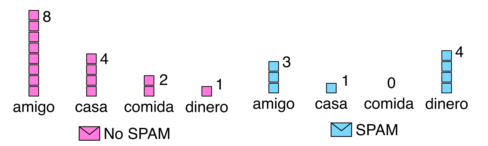

# TP3: Detector de SPAM

Uno de los problemas más comunes en clasificación es la detección de correos electrónicos SPAM. Uno de los primeros modelos utilizados para abordar este problema fue el clasificador de Bayes ingenuo (Naive Bayes). La detección de SPAM sigue siendo un problema persistente en el mundo digital, ya que los spammers continúan adaptando sus estrategias para evadir los filtros de correo no deseado. Además del clasificador de Bayes ingenuo, se han desarrollado y utilizado técnicas más avanzadas, que incluyen algoritmos de aprendizaje automático, redes neuronales y métodos basados en reglas.

En este trabajo práctico utilizaremos un conjunto de datos que consta de 4601 observaciones de correos electrónicos, de los cuales 2788 son correos legítimos y 1813 son correos SPAM. Dado que el contenido de los correos electrónicos es un tipo de dato no estructurado, es necesario procesarlo. En este conjunto de datos ya se ha aplicado un procesamiento típico del campo de Procesamiento de Lenguaje Natural (NLP), que consiste en contar la frecuencia de palabras observadas en los mensajes.

El procesamiento de lenguaje natural desempeña un papel fundamental en la detección de SPAM, ya que permite analizar el contenido de los correos y extraer características relevantes para su clasificación. Además del simple conteo de palabras, se pueden aplicar técnicas más sofisticadas, como la extracción de características semánticas o el análisis de sentimientos, para mejorar la precisión de los modelos de detección.

En este proceso, se contabiliza la cantidad de ocurrencias de cada palabra en los diferentes correos.

Con el fin de preservar la privacidad de los mensajes, la frecuencia de palabras ha sido normalizada. El conjunto de datos está compuesto por 54 columnas de atributos denominadas:

- `word_freq_XXXX`: donde `XXXX` representa una palabra o símbolo. Los valores son enteros que van de 0 a 20.000.

Además, incluye una columna adicional llamada `spam`, que toma el valor 1 si el correo es SPAM, y 0 si no lo es.

Los clasificadores de Bayes ingenuos fueron de los primeros filtros utilizados por aplicaciones de correo electrónico, y se basan en este principio: partiendo de una probabilidad a priori de que un correo sea SPAM, ciertas palabras pueden modificar esa probabilidad a posteriori, sugiriendo si un mensaje tiene mayor o menor probabilidad de ser SPAM.

Para este trabajo práctico, se proporciona una notebook (`ayuda.ipynb`) con la lectura del conjunto de datos, la 
separación de los datos, entre otras ayudas para resolverlo.

## Tareas y preguntas a resolver:

1. ¿Cuáles son las 10 palabras o símbolos más frecuentes en correos SPAM y en correos NO SPAM?
    - ¿Hay palabras o símbolos en común?
    - ¿Alguna resulta llamativa?
2. Separe el conjunto de datos en un conjunto de entrenamiento (70%) y uno de prueba (30%).
3. Utilizando un **clasificador de Bayes ingenuo**, entrene el modelo con el conjunto de entrenamiento.
4. Utilizando un **clasificador de Regresión Logística**, entrene el modelo con el conjunto de entrenamiento (en este caso, normalice los datos).
5. Calcule la **matriz de confusión** en el conjunto de prueba para ambos modelos.
    - ¿Qué tipo de error comete más cada modelo?
    - ¿Cuál de los dos tipos de error considera más importante en este problema?
6. Calcule las **métricas de precisión (precision) y recuperación (recall)** para ambos modelos.
    - ¿Cuál es el mejor modelo según cada métrica?
    - ¿Cómo se relacionan estas métricas con los errores analizados en el punto anterior? Fundamente su respuesta.
7. Obtenga la **curva ROC y el AUC (Área Bajo la Curva ROC)** de ambos modelos.

### Entregables

El entregable debe consistir en uno o más archivos Jupyter Notebook (`ipynb`) con las respuestas. Aunque se permite el uso de otros formatos, es fundamental incluir tanto el código como las respuestas.

Pueden subir el contenido directamente o proporcionar un enlace a un repositorio público (GitHub o GitLab). **No olviden especificar los nombres de los autores del trabajo práctico en el entregable.**

#### Recursos

Para resolver este trabajo práctico, tienen libertad de utilizar los recursos que consideren necesarios. Pueden realizarlo en cualquier lenguaje de programación y de la forma que crean más adecuada.
